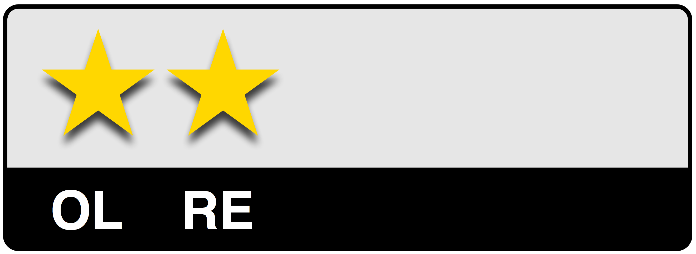
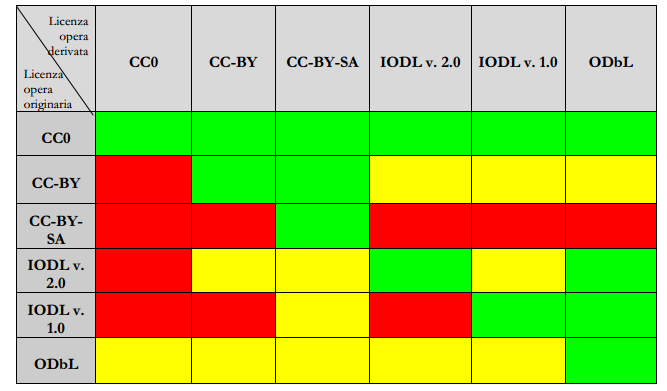
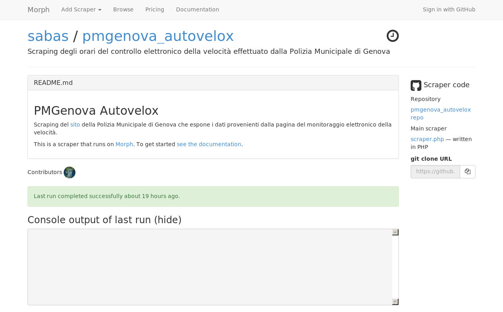
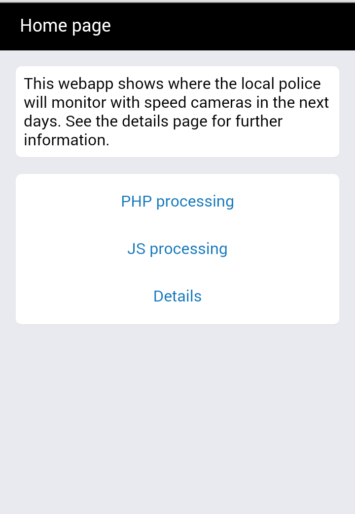
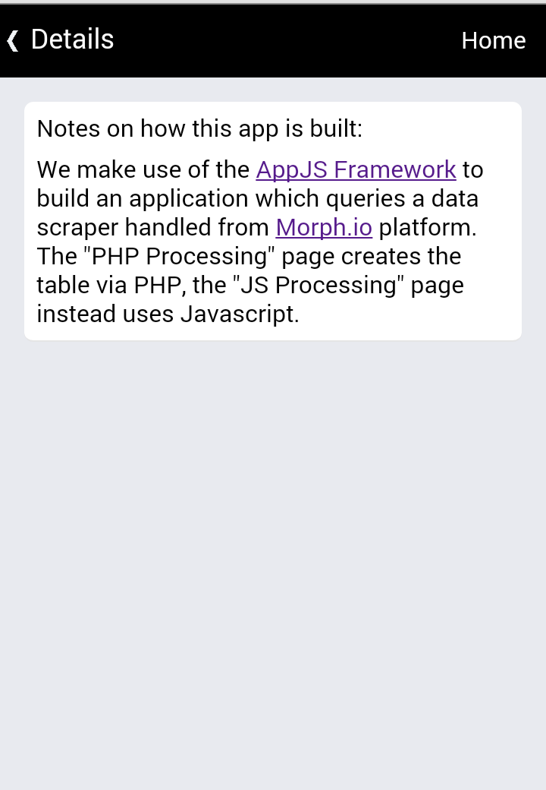
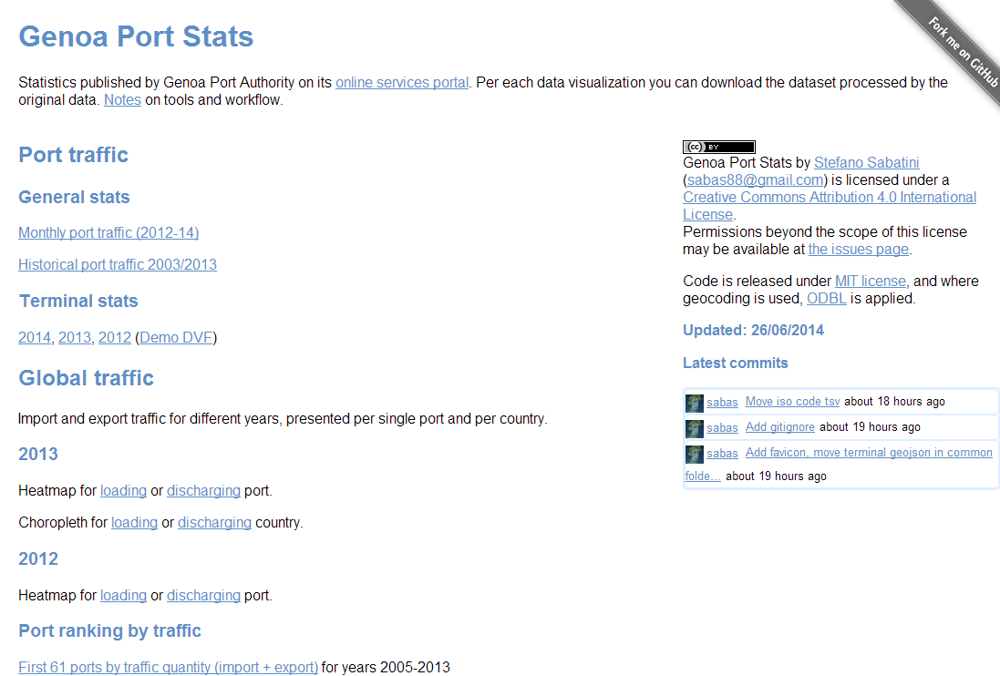
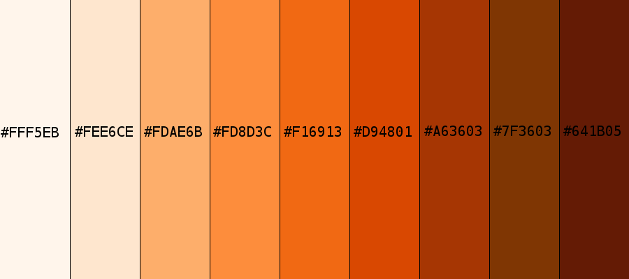
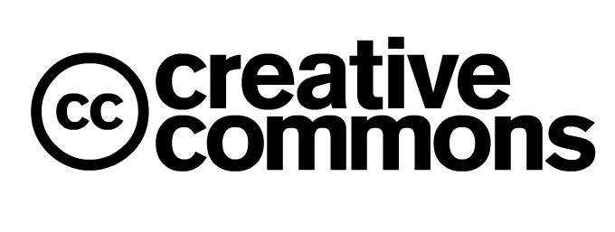
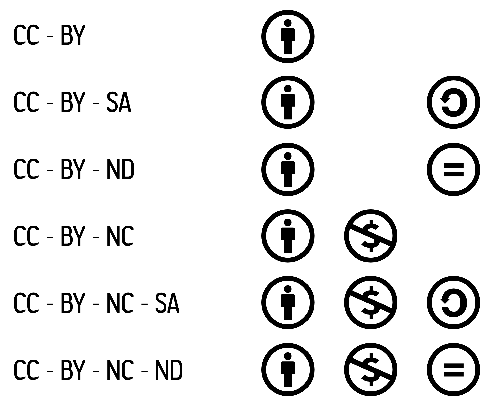

Abstract
========

La rivoluzione iniziata dalla disponibilità dei primi software a sorgente aperto si è pian piano allargata ad ambiti culturali più ampi ed è stata una delle basi per l’evoluzione della società dell’informazione: i dati, per essere alla base di riflessioni ed essere motore dell’economia in questo step evolutivo, dovrebbero essere disponibili a tutti e standardizzati.

Nel corso della discussione si esaminano i principali temi legati alle motivazioni, alle necessità e alle metodologie del rilascio di dati aperti per poi proporre due esempi di riutilizzo di informazione disponibile in rete ma non aperta secondo i criteri esposti.

Ringraziamenti
==============

Desidero ringraziare innanzitutto la mia Relatrice, la professoressa Marina Ribaudo, per la guida durante la stesura di questa prova finale e per il supporto negli ultimi anni del mio percorso universitario.

Ringrazio i miei genitori, mia nonna ed i miei parenti per aver pazientemente atteso che concludessi questo percorso di studi.

Infine i miei ringraziamenti vanno anche a:

-   Maurizio Napolitano e Simone Cortesi per la loro attività di promozione del tema dei dati aperti in Italia e per avermi spinto ad approfondirlo.

-   Andrea Zedda per le puntualizzazioni sulle visualizzazioni usate nel progetto sulle statistiche portuali e Fabrizio Tambussa per alcuni commenti in corso d’opera.

Nota dell’autore
================

Questo documento è stato composto usando LyX (<http://www.lyx.org/>) e lo stile tipografico per LaTeX  `classicthesis` (<http://code.google.com/p/classicthesis/>).

Ogni errore o imprecisione è imputabile al solo autore.

Open Source ed Open Knowledge
=============================

Gli Anni ’90 hanno visto affermarsi il movimento open source e l’affacciarsi di questo verso il mondo dei non specialisti.

Inizialmente la vertiginosa evoluzione del kernel Linux, sviluppato da Linus Torvalds a partire dal 1992 e pubblicato sotto una licenza libera come la GPL[^1], ha portato a compimento l’ecosistema predicato da Richard Stallman in quello che adesso è noto come Gnu/Linux.

Il rilascio del codice di Netscape Navigator nel 1998, che ha dato inizio al progetto Mozilla, è stato spinto anche dalla pubblicazione del saggio di Eric S. Raymond “La Cattedrale e il Bazaar”, in cui si descriveva l’approccio allo sviluppo del software da parte delle case commerciali - detto a *cattedrale*- contrapposto a quello dei progetti open source - a *bazaar*-[^2]. Incidentalmente, proprio questo saggio è stato il primo libro distribuito commercialmente ad essere pubblicato anche con una licenza aperta[^3], la Open Publication License la quale, insieme alla precedente Open Content License, ha trasposto il concetto di open source nei contenuti creativi, diventando di fatto la madre delle licenze di tipo Creative Commons[^4].

Free Software
-------------

Richard Stallman e la sua Free Software Foundation pubblicano nel febbraio 1986[^5] la prima versione della definizione di *free software* (software libero).

Un software è definito libero se possiede quattro libertà:

-   Libertà di eseguire il programma, per qualsiasi scopo (libertà 0).

-   Libertà di studiare come funziona il programma e di modificarlo in modo da adattarlo alle proprie necessità (libertà 1).

-   Libertà di ridistribuire copie in modo da aiutare il prossimo (libertà 2).

-   Libertà di migliorare il programma e distribuirne pubblicamente i miglioramenti apportati (e le versioni modificate), in modo tale che tutta la comunità ne tragga beneficio (libertà 3).

L’accesso al codice sorgente è un prerequisito delle libertà sopraelencate.

Open Source Definition
----------------------

Nel febbraio 1998, poco dopo il rilascio di Netscape Navigator, Eric S. Raymond fonda insieme a Bruce Perens la Open Source Initiative (OSI):

> *Uno sforzo prolungato per argomentare il “software libero” sui piani pragmatici dell’affidabilità, del costo, e del rischio strategico d’impresa*[^6].

Uno dei primi risultati dell’OSI deriva da un lavoro pregresso di Perens all’interno della comunità Debian: nel luglio 1997[^7] egli propone una *policy* composta dal Debian Social Contract -nel quale si asserisce che Debian sarà composto esclusivamente di free software- e dalle Debian Free Software Guidelines -che classificano cosa è un free software a seconda della licenza sotto la quale è reso disponibile. Raymond, che aveva già esposto a Perens i concetti che porteranno alla OSI nel febbraio di quell’anno, trovò che le linee guida dovessero diventare il documento definente il termine “open source” al netto dei riferimenti a Debian, così chiese a Perens stesso di riscrivere questo testo che, assieme al *certification mark* (attestato di certificazione) ottenuto per “open source”, diventò patrimonio dell’OSI.

I punti della definizione sono 10 (erano 9 fino al 2004)[^8]:

1.  Libera ridistribuzione: la licenza non deve impedire la ridistribuzione come componente di una distribuzione di software proveniente da diverse sorgenti e non deve prevedere percentuali sulle vendite.

2.  Codice sorgente: insieme al programma deve essere distribuito (o linkato) il codice sorgente, senza offuscamenti o compilazioni intermedie.

3.  Opere derivate: deve essere permessa la modifica e la creazione di opere derivate obbligando a mantenere gli stessi termini di licenza.

4.  Integrità del codice sorgente dell’Autore: può essere vietata la distribuzione del codice sorgente modificato solo se è permessa la distribuzione di *patch* per modificare il codice originale in fase di compilazione; deve essere permessa la distribuzione di software creato dal codice sorgente modificato ma può essere richiesto il cambio di nome o di versione.

5.  Nessuna discriminazione rispetto a persone o gruppi di persone.

6.  Nessuna discriminazione rispetto agli ambiti di impiego (del programma).

7.  Distribuzione di licenza: la licenza deve applicarsi a tutto il software (non sono permesse ulteriori clausole aggiuntive).

8.  La licenza non deve essere specifica di un prodotto: deve cioè valere anche se una parte di quel prodotto viene riutilizzata in altri prodotti.

9.  La licenza non deve limitare altro software: non è permesso richiedere che tutto il software insieme al quale viene distribuito sia anch’esso open source.

10. La licenza dev’essere neutrale rispetto alla tecnologia: non deve cioè legare il software e le sue parti ad un requisito particolare (come ad esempio una GUI).

Creative Commons
----------------

La famiglia di licenze Creative Commons, che copre ambiti culturali non necessariamente legati al mondo dello sviluppo software, prende ispirazione dalla GNU Public License della Free Software Foundation e dall’Open Publication License.

Le licenze Creative Commons (CC) sono il prodotto di un gruppo di persone associatesi per supportare il caso di Eric Eldred contro lo stato americano, in cui egli proclamava l’illegittimità del Sonny Bono Copyright Term Extension Act[^9] che estendeva di 20 anni la protezione delle opere coperte da copyright: formatasi inizialmente il 17 Febbraio 1999 come Copyright Commons, questa associazione viene ufficialmente fondata da Lawrence Lessig col nome attuale il 16 Gennaio 2001.

Un mese prima che la Corte Suprema affermasse la costituzionalità dell’atto, il 16 Dicembre 2002 viene rilasciata la versione 1.0 delle licenze ed in un anno trova applicazione in 3 milioni di opere.

In una presentazione del 2008[^10], Lawrence Lessig sintetizza così le ragioni dietro al movimento che ha portato alle Creative Commons:

> *Era nato come un movimento attivista di creatori, altrimenti detti detentori di copyright, che guardavano la dicitura “Tutti i diritti riservati” affermando ’non mi servono tutti i diritti, al massimo me ne serve qualcuno’.*

Il 25 Novembre 2013 viene ufficialmente rilasciata la versione 4.0 delle licenze.

Open Knowledge Definition
-------------------------

Con le Creative Commons si parla finalmente di *conoscenza aperta*. Ma cos’è la conoscenza? Cosa vuol dire *aperta*?

Nel 2004 viene registrata in Inghilterra come organizzazione non profit l’Open Knowledge Foundation (OKFN). Essa si dedica a

> *promuovere la creazione, diffusione ed uso della conoscenza aperta in tutte le sue forme, dai geni ai geodati e dai sonetti alle statistiche*[^11].

Nell’Agosto 2005 pubblica la prima bozza della Open Definition[^12], che definisce (il termine) “Open in Open Data, Open Content and Open Services”, lasciando esplicitamente fuori il software in quanto “è stato adeguatamente trattato da lavori precedenti”.

Innanzitutto la **conoscenza** include:

-   contenuti (creativi) come musica, video, libri;

-   dati, che siano scientifici, storici, geografici o di altro genere;

-   informazioni governative ed amministrative.

Viene inoltre usato il termine **opera** (*work*) per denotare l’oggetto di conoscenza trasferito ed il termine **pacchetto** per un insieme di opere.

Un’opera viene definita aperta se soddisfa queste condizioni:

1. Accesso: l’opera dev’essere accessibile interamente con al massimo i costi di riproduzione, ma deve essere disponibile anche in un formato modificabile.

2. Ridistribuzione: la licenza non deve restringere la vendita o la cessione dell’opera sia da sola sia come parte di un pacchetto, e non deve richiedere percentuali sulle vendite.

3. Riuso: la licenza deve permettere modifiche e opere derivate e deve permettere che siano distribuite con gli stessi termini dell’opera originale.

4. Assenza di restrizioni tecnologiche: l’opera non deve avere ostacoli tecnologici ai punti precedenti, ovvero deve essere anche distribuita in un formato dati aperto.

5. Attribuzione: la licenza può prevedere per la redistribuzione ed il riuso la condizione di attribuzione ai creatori e contributori dell’opera, senza però essere onerosa.

6. Integrità: la licenza può richiedere come condizione per la distribuzione dell’opera modificata che essa porti un diverso nome (o numero di versione) rispetto all’opera originale.

7. Nessuna discriminazione nei confronti di persone o gruppi.

8. Nessuna discriminazione nei confronti dei campi di impiego.

9. Distribuzione della licenza.

10. La licenza non deve essere specifica di un pacchetto.

11. La licenza non deve restringere la distribuzione di altre opere.

### Confronto con la Open Source Definition

| OSD | OD   | Confronto|
|-----|------|----------|
| 1   | 2    | Viene riscritto il punto adattando la terminologia (software diventa opera)|
| 2   | 10   | Il paragone sussiste pensando alle opere in formato proprietario come ai programmi compilati, e viene anche specificato che l’opera/il software non deve dipendere da particolari tecnologie; viene affermata la gratuità del software o dell’opera a meno dei costi di riproduzione sul mezzo fisico (mentre su Internet deve essere gratuito)|
| 3   | 3    | La distribuzione dell’opera derivata nella OD viene definita come riuso|
| 4   | 6    | Nella OD viene preservata solo l’ultima frase della OSD, eliminando quindi i particolari sul codice sorgente|
| 5-9 | 7-11 | Sono esplicitamente dichiarate uguali 

Nei commenti alla Open Definition viene affermato esplicitamente che i punti 7-11 corrispondono in relazione 1:1 ai punti 5-9 della Open Source Definition. Nella Tabella soprastante si confrontano i singoli punti.

Linked open data
================

Introduzione
------------

Tim Berners-Lee esprime nel Settembre 1998[^13] la sua visione di cosa debba diventare il Web, spiegando che la sua architettura deve evolvere dal rendere facile la comunicazione tra gli uomini al facilitare anche la comunicazione fra le macchine. Per fare questo, egli spiega che le informazioni debbano essere espresse in una forma che sia processabile anche dai computer.

Dalla rete degli ipertesti, il web deve diventare anche la rete dei dati, ovvero il **Web Semantico**. Per rendere l’informazione esplorabile, bisogna introdurre il concetto di link anche nei dati, ottenendo così i **linked data**.

Il web dei dati ha quattro regole:

1.  Gli oggetti devono avere nomi composti (esser identificati) da URI[^14].

2.  Gli URI devono seguire le specifiche del protocollo HTTP per permettere la ricerca dei nomi.

3.  Quando vengono accedute risorse tramite URI, bisogna rispondere con informazioni utili usando standard definiti (RDF, SPARQL).

4.  Bisogna includere link ad altri URI, per permettere di scoprire più oggetti.

Classificazione di Berners-Lee
------------------------------

Quando si parla di Open Data ci si chiede come sia possibile realizzarli, e Berners-Lee nel 2010 ha aggiunto alle sue definizioni di linked data una classificazione a stelle per valutare quanto sia “buono” un dato esposto in modo aperto:

##### Una stella


Il dato pubblicato sul web per ottenere una stella deve essere posto sotto una licenza libera (OL, Open License).

La condizione sulla licenza è l’unica da soddisfare, infatti viene specificato “qualunque formato”.

Il documento contenente il dato è accessibile, riusabile e condivisibile, ma non è manipolabile facilmente.

Ad esempio un file in formato PDF otterrà una stella, così come una scannerizzazione di un documento.

##### Due stelle



Un dato a cui sono assegnate due stelle è un documento strutturato leggibile da una macchina e riusabile (RE, Reusable), ma in un formato proprietario.

##### Tre stelle


La terza stella viene assegnata ad un documento che possiede già due stelle, ma che viene rilasciato in un formato non proprietario (OF, Open Format).

##### Quattro Stelle


Il passaggio dalle tre alle quattro stelle è quello più complicato, perché richiede che i dati siano identificati (URI, Uniform Resource Identifier) con degli standard come il Resource Description Framework (RDF).

##### Cinque Stelle


L’ultima stella viene aggiunta quando il dato è finalmente integrato con altri dati nel Web (LD, Linked Data), ovvero quando esistono link in entrata da o in uscita verso altri datastore.

RDF
---

Per creare il Web dei dati è necessario introdurre informazioni sui dati stessi, ovvero i *metadati*.

I metadati sono informazioni strutturate che consentono di descrivere, localizzare o usare più facilmente i dati e gli oggetti. Il concetto è vecchio quanto i sistemi di classificazione (ad esempio la Classificazione Decimale Dewey usata nella catalogazione bibliotecaria risale al 1876), ma il termine viene usato per la prima volta nel 1968[^15]. I metadati si possono distinguere in tre famiglie:

-   **descrittivi** (identificano un oggetto),

-   **strutturali** (descrivono la composizione di un oggetto),

-   **amministrativi** (informano sulla gestione di un oggetto).

Questi metadati sono legati alla risorsa che descrivono da un URI univoco. Lo standard per codificare questo modello è noto come Resource Description Framework, in breve RDF[^16]: esistono diversi metodi per rappresentare il modello dei dati, tra i quali si segnalano RDF/XML (RDF in sintassi XML) e RDFa (RDF in Attributes, che estende XHTML per integrare metadati nei documenti web).

Una risorsa è descritta da una o più *statement* -o asserzioni- composte da tre oggetti (da cui **tripla**):

-   il **soggetto**,

-   una **proprietà** (o **predicato**),

-   l’**oggetto** (o *valore* della proprietà).

Le risorse si legano tra loro in un grafo: infatti le proprietà possono avere valori costituiti da altre risorse e le proprietà stesse sono rappresentabili come archi.

### RDF/XML

Una delle sintassi più usate per rappresentare un grafo RDF è basata su XML[^17].

I soggetti di una tripla sono rappresentati da un elemento XML con elementi figli rappresentati dalle proprietà con i rispettivi valori. Nel caso un nodo non abbia figli, esso è rappresentato come un elemento vuoto.

Nel caso in cui il contenuto di una proprietà sia una stringa, questa proprietà può venir rappresentata come attributo del nodo.

I namespace XML (rappresentati da un prefisso nelle proprietà) identificano i **vocabolari**. Un nome più formale utilizzato per i vocabolari è quello di **ontologia**, ma, come asserito dal W3C[^18], la differenza sta proprio nei contesti in cui vengono scritti: si preferisce parlare di ontologia quando si trattano formalmente collezioni complesse di termini.

Le relazioni fra le risorse e le proprietà sono descritte tramite un RDF Schema[^19], il linguaggio per la descrizione dei *vocabolari* che, a sua volta, è un vocabolario identificato dal namespace con prefisso `rdfs`[^20]. Lo spazio dei nomi radice è invece identificato dal prefisso `rdf`.

Per elencare più risorse si usano i *contenitori* -`rdf:Container`-** Bag** (lista non ordinata -`rdf:Bag`-), **Sequence** (lista ordinata-`rdf:Seq`-), **Alternative** (lista di cui il valore valido è solo uno -`rdf:Alt`-).

Le classi sono gruppi di risorse descritte da proprietà: le risorse sono istanza (`rdf:type`) della classe. Più classi possono avere lo stesso insieme di istanze, ma diverse proprietà.

Le proprietà sono descritte da un *dominio* di applicabilità (in una tripla, la risorsa è della classe specificata dal dominio della proprietà) e da un *range *(il valore è della classe specificata dal range della proprietà).

Il vocabolario principale RDF Schema ha namespace (abbreviato `xmlns`) `rdfs`.

L’esempio dell’attribuzione di questa prova finale nel formato RDF/XML diventa come nel listato seguente.

```xml
<?xml version="1.0" encoding="UTF-8"?>
<rdf:RDF xmlns:xhtml="http://www.w3.org/1999/xhtml/vocab#"
    xmlns:dct="http://purl.org/dc/terms/"
    xmlns:cc="http://creativecommons.org/ns#"
    xmlns:rdf="http://www.w3.org/1999/02/22-rdf-syntax-ns#">
<rdf:Description rdf:about="http://www.stefanosabatini.eu/thesis/">
    <dct:title>Distribuzione di dati aperti e riutilizzo delle informazioni</dct:title>
    <cc:attributionName>Stefano Sabatini</cc:attributionName>
    <xhtml:license rdf:resource="http://creativecommons.org/licenses/by/4.0/"/>
</rdf:Description>
```

### RDFa

RDFa, ovvero *Resource Description Framework in Attributes* è una Raccomandazione del W3C[^21] che estende i linguaggi basati su XML come XHTML ed HTML5 introducendo un insieme di attributi che permettono di integrare metadati riconducibili alle triple RDF per fornire una metadatazione automatica dei documenti.

Inizialmente proposto per XHTML 2.0 (specifica poi abbandonata), il gruppo di lavoro ha introdotto un modulo per XHTML 1 che ha raggiunto lo status di Raccomandazione nell’ottobre del 2008. La revisione 1.1, che abbandona il requisito dei namespace XML rendendone possibile l’utilizzo all’interno di documenti HTML, è diventata Raccomandazione nel 2012.

Le informazioni sulla proprietà intellettuale di un documento possono essere descritte tramite metadati riconoscibili automaticamente con il linguaggio ccREL, che applica i concetti dell’RDFa alle licenze Creative Commons (si rimanda all’Appendice A per una trattazione di queste). Ad esempio il listato [alg:Descrizione-in-ccREL] descrive questa prova finale.

```html
<span xmlns:dct="http://purl.org/dc/terms/" property="dct:title">Distribuzione di dati aperti e riutilizzo delle informazioni</span> 
di <a xmlns:cc="http://creativecommons.org/ns#" href="http://stefanosabatini.eu/thesis/" property="cc:attributionName" rel="cc:attributionURL">Stefano Sabatini</a>
è distribuito con Licenza <a rel="license" href="http://creativecommons.org/licenses/by/4.0/">Creative Commons Attribuzione 4.0 Internazionale</a>.
```

Si può notare come:

-   vengano usati i namespace per indicare l’URI dell’attributo;

-   il soggetto sia il documento stesso;

-   l’attributo *property* sia la proprietà della tripla;

-   il predicato sia il contenuto del tag a cui è applicata la proprietà;

-   l’attributo *rel* venga usato come proprietà per l’oggetto href (non può prendere il valore testuale, nel caso non ci sia href, prende come valore quello degli eventuali nodi figli).

Nel caso dei link (tag `<a>`), l’attributo property, invece di avere il contenuto del tag `<a>` come valore, ha come valore quello dell’attributo `href`. Se però si vuole definire il valore dell’attributo manualmente, si può usare l’attributo `content` (lasciando ad esempio la versione human-readable come valore visibile).

Un insieme uniforme di tag con proprietà provenienti dallo stesso vocabolario può dichiarare questo nel tag genitore usando l’attributo `vocab`, evitando di ripetere in ognuno l’URI completo. Se appartengono allo stesso oggetto (o classe), quest’ultimo si può dichiarare con l’attributo `typeof`.

### Vocabolari

In fase di definizione di uno schema per una applicazione è utile fare uso di vocabolari preesistenti quando ci si trova a voler definire una relazione o una proprietà.

Molti schemi sono già stati definiti, e qui citiamo i seguenti:

-   **FOAF**[^22], acronimo di Friend Of A Friend, è un dizionario (nato nel 2000 ed aggiornato nel 2008) dedicato alla descrizione di reti, che siano sociali o informative: fornisce strumenti per evidenziare e descrivere persone e connessioni. Ad esempio, nella specifica[^23] si vede che una persona (`foaf:Person`) è una sottoclasse di Agente (`foaf:Agent`) che raccoglie anche una azienda (`foaf:Organization`); le proprietà descrivibili vanno dal nome (`foaf:firstName`, implica che la risorsa sia un `foaf:Person`) agli account su vari network (`foaf:skypeID`, `foaf:jabberID`, i quali appartengono a `foaf:OnlineChatAccount` che è sottoclasse di `foaf:OnlineAccount`).

-   **DC**[^24], acronimo di Dublin Core, deriva da un sistema prodotto nel 1995 ed ha lo scopo di descrivere risorse digitali accessibili in rete. Il set principale di metadati, l’Element Set (DCES), consta di quindici elementi (che vengono preceduti dal namespace `dc` o `dct`[^25]): `contributor`, `coverage`, `creator`, `date`, `description`, `format` (MIME), `identifier`, `language`, `publisher`, `relation`, `rights`, `source`, `subject`, `title`, `type` (i valori di quest’ultimo sono controllati tramite vocabolario DCMI `type`).

-   **SKOS**[^26] è una specifica del W3C per l’organizzazione della conoscenza. I termini del vocabolario[^27] descrivono schemi di concetti e relazioni semantiche (`narrower`, `broader`, `related`).

-   **GN**[^28] è l’ontologia creata per il database Geonames[^29] che raccoglie più di dieci milioni di feature geografiche, la loro classificazione e la posizione. L’ontologia permette di descrivere codici di avviamento postale (`gn:postalCode`), le feature vicine (`gn:nearby`) e organizzazioni genitore/figlio (`gn:children`, ad esempio questo è il caso degli stati contenuti in un continente, essi sono figli del continente a fini della rappresentazione).

-   **WGS84_pos**[^30] è un semplice dizionario che descrive un oggetto spaziale (`wgs84_pos:SpatialThing`) rappresentato da un punto (`wgs84_pos:Point`), le sue coordinate e l’altitudine nel sistema di riferimento WGS84 (`wgs84_pos:lat`, `wgs84_pos:long`, `wgs84_pos:alt`).

### TURTLE e SPARQL

SPARQL (acronimo ricorsivo per SPARQL Protocol And RDF Query Language) è un linguaggio simile allo SQL che permette di interrogare e manipolare dati in lettura nel formato RDF. Le raccolte di dati RDF (datastores) hanno un punto di accesso in cui scrivere le query detto **endpoint.**

SPARQL è basato sulla sintassi TURTLE[^31], la quale permette di descrivere i grafi RDF in un modo più vicino al linguaggio naturale rispetto ad RDF/XML:

-   Le risorse sono rappresentate da IRI[^32] racchiusi tra coppie di parentesi uncinate `<>`.

-   Si definisce eventualmente una base per i nomi che formeranno gli IRI con la direttiva `@base`.

-   Eventuali altre basi sono definite tramite prefissi (che verranno anteposti dove necessario) con la direttiva `@prefix`.

-   Un predicato `type` (in RDF/XML rdf:type, la relazione “istanza di”) è abbreviato da `a`.

-   Le triple sono terminate da un punto.

-   Il punto e virgola separa elenchi di proprietà e valori relativi allo stesso soggetto.

-   Alle stringhe (literal) possono venir assegnate lingua (aggiungendo dopo di essa `@` seguito dal codice di due lettere) e tipo (aggiungendo dopo di essa `^^` seguito da un datatype XML con namespace `xsd`).

Ad esempio la descrizione di questa prova finale fornita in precedenza viene riscritta in Turtle[^33] come si può vedere nel listato seguente.

```rdf
    @prefix xhtml: <http://www.w3.org/1999/xhtml/vocab#>.
    @prefix dct: <http://purl.org/dc/terms/>.
    @prefix cc: <http://creativecommons.org/ns#>.
    <http://www.stefanosabatini.eu/thesis/>
      dct:title "Distribuzione di dati aperti e riutilizzo delle informazioni";
        cc:attributionName "Stefano Sabatini";
        xhtml:license <http://creativecommons.org/licenses/by/4.0/>.
```

Per scrivere una query SPARQL

-   Le direttive `@prefix` di Turtle diventano `PREFIX` e perdono il punto.

-   I soggetti e i valori in una tripla possono diventare variabili, e il nome della variabile va preceduto dal punto di domanda.

-   Se una variabile è usata in più triple, è implicito il join.

-   Una query è composta al massimo dagli elementi `PREFIX`, `FROM`, `SELECT`, `WHERE` più modificatori (`ORDER BY`, `LIMIT`).

-   La clausola `FROM` indica l’URI del dataset / datastore da interrogare: negli endpoint legati ad un particolare datastore questa non è necessaria.

-   La clausola `SELECT` permette di selezionare quale delle variabili utilizzate verranno mostrate nei risultati (inserendo `SELECT *` verranno mostrate tutte), aggiungendo `DISTINCT` vengono eliminati i duplicati.

-   I modificatori sono come quelli disponibili in SQL (`LIMIT` limita la quantità di risultati, `ORDER BY` ordina i risultati, `OFFSET` permette di fare la paginazione dei risultati).

-   La clausola `WHERE` accetta triple scritte in Turtle, alle quali vengono sostituite risorse da variabili, e che possono venir filtrate tramite la parola chiave `FILTER` e condizioni booleane.

-   Il predicato `rdfs:label` viene utilizzato per dare nomi “leggibili” alle risorse.

-   A disposizione ci sono anche dei test sulle risorse (`isURI`, `isBlank`) e degli operatori di accesso (ad esempio `lang` estrae la lingua da una stringa).

### Sistemi di storage per RDF

Per poter gestire i dati ed i loro metadati in formato RDF sono state proposte delle soluzioni che hanno mascherato o sostituito i sistemi di storage relazionali (RDBMS) Il principale problema dei database relazionali è la necessità di fornire la strutturazione a priori dello schema dei dati, cosa che non è possibile soddisfare con il concetto logico di tripla: un set di triple è rappresentato da un grafo, il quale trova la sua implementazione in un **triple store** (o database RDF). In realtà per diverse applicazioni sarebbe più corretto parlare di **quadstore**: oltre ai tre elementi di una tripla, viene salvato all’interno della tabella del database anche il nome del grafo (o della risorsa) di appartenenza[^34].

Per quanto riguarda l’uso di soluzioni basate su database relazionali si distinguono gli approcci:

-   **triple table**: una tabella contente tre colonne indicizzate su cui vengono mappate le triple. Query complesse richiedono join sulla stessa tabella, pertanto diventerebbero estremamente lente.

-   **property table**: una tabella contiene una riga per ogni soggetto e tante colonne quante solo le possibili proprietà (pertanto vengono mappate più triple per riga). Una variante (property-class table) clusterizza in base all’istanza del soggetto (`rdf:type`). I problemi di questa scelta sono la generazione di valori nulli se non sono definite tutte le proprietà per un soggetto, la difficoltà di rappresentare attributi multivalore e la perdita di flessibilità (aggiungere colonne quando si introducono proprietà).

-   **vertical partitioning**: esistono tante tabelle quante sono le proprietà definite, e possiedono solamente una colonna per il soggetto della tripla ed una per l’oggetto; necessita di un DBMS column-oriented (nel quale i dati sono rappresentati per colonne anzichè per righe) ma permette attributi multivalore.

L’approccio nativo è costituito dall’approccio multi-indexing: l’obiettivo è rendere uguali dal punto di vista della gestione le query che richiedono

-   triple con stessa proprietà;

-   triple con stesso soggetto;

-   liste di proprietà od oggetti relative ad uno stesso soggetto.

### DBpedia

La più grande fonte di conoscenza su Internet è probabilmente Wikipedia: perché non usarla come fonte di linked data? È quello che è stato fatto dal progetto DBpedia[^35], il quale ha estratto (e continua a farlo) conoscenza da 119 lingue totalizzando al momento 24,9 milioni di oggetti e 2,46 miliardi di triple, diventando il nucleo su cui si basa l’ecosistema attuale dei linked data, come si osserva dalla nuvola, chiamata proprio **linked data cloud**[^36].


I dati che compongono DBpedia sono estratti[^37] principalmente dalla tabella[^38] che si trova in alto a destra nella maggior parte delle voci, in quanto è già di per sé una raccolta strutturata di dati fattuali: i template vengono trasformati in triple RDF, i link in URI, le unità di misura vengono riconosciute come tipi di dato e le liste vengono convertite nelle rispettive versioni RDF.

Il progetto presenta una versione ’live’, ovvero sincronizzata con Wikipedia, per tenere traccia delle modifiche e degli aggiornamenti: ciò è possibile grazie ad un feed da Wikipedia, tramite protocollo OAI-PMH[^39], che viene inviato ad un mirror locale. Le modifiche su questo passano per l’estrattore di dati quando contengono modifiche ai dati utilizzati. Attualmente, secondo calcoli dei responsabili del progetto, vengono effettuate 84 modifiche al minuto alle pagine di Wikipedia, ed il sistema è in grado di reggere fino a 105 modifiche al minuto.

Il backend, gestito tramite Virtuoso, può essere interrogato tramite un endpoint SPARQL (<http://live.dbpedia.org/sparql>).

Tra le varie applicazioni si segnalano:

-   il progetto Spotlight[^40], il quale annota testi con le risorse provenienti da DBpedia;

-   LodLive[^41], un browser che collega diversi endpoint, tra cui DBpedia, e permette ricerche su grafi.

La query riprodotta nel listato sottostante risolve un problema operativo[^42]: produrre una lista di nominativi unici di persone italiane presenti su Wikipedia. Ciò è stato fatto selezionando i soggetti che siano persone, italiane e la cui voce usa il Template relativo alle biografie; in più sono stati eliminati i duplicati con una espressione regolare che controlla se il cognome non sia presente nel nome.

```sparql
SELECT DISTINCT ?name, ?surname, CONCAT( Str(?name), ' ', Str(?surname)) WHERE {
  ?person a <http://dbpedia.org/ontology/Person> .
  ?person   <http://it.dbpedia.org/property/nome>    ?name .
  ?person   <http://it.dbpedia.org/property/cognome> ?surname .
  ?person   <http://it.dbpedia.org/property/nazionalità> "italiana"@it .
  ?person  <http://it.dbpedia.org/property/wikiPageUsesTemplate> <http://it.dbpedia.org/resource/Template:Bio>.
  FILTER( isLiteral(?name) AND isLiteral(?surname) AND (!REGEX (?name,?surname)) ) 
}
```

Valutazione dei dati
====================

Il problema della scala di Tim Berners-Lee, diffusamente usata per vedere “ad occhio” se un dato è buono, è l’essere legata all’ambito nel quale è stata inizialmente proposta, i Linked Data.

Attribuendo i valori più alti a dati che vengono esposti come LOD (RDF, come endpoint SPARQL, eccetera), si sottovalutano insiemi di dati che non ricavano beneficio dall’essere completamente nella nuvola dei dati collegati e non si misura come i dati vengano utilizzati.

Si espongono di seguito approcci alternativi alla valutazione dei dati e si conclude con delle idee di sintesi.

Open Data Engagement: la scala di Davies
----------------------------------------

Nel 2012 ad un workshop sugli Open Government Data (OGD) - i dati aperti prodotti dagli enti pubblici- Tim Davies propone una scala del “coinvolgimento sui dati aperti” (*open data engagement*[^43]) per trovare un parallelo non tecnico alla scala di Berners-Lee.

La premessa considera le informazioni governative come patrimonio pubblico gestito dal governo che fornisce una piattaforma di trasparenza e coinvolgimento del cittadino nelle scelte della cosa pubblica ed asserisce che il governo dovrebbe essere parte attiva nell’assicurarsi che i dati possano essere usati da tutti.

Il coinvolgimento di un ente pubblico nel mettere a disposizione i dati aperti dovrebbe:

##### Esser guidato dalla domanda

La scelta di cosa pubblicare dovrebbe essere legato alla domanda di dati, e bisognerebbe ascoltare in qualche modo le richieste dei cittadini, rispondendo ad esse con dati aperti.

##### Contestualizzare i dati

I metadati associati dovrebbero includere frequenza di aggiornamento, formato e qualità dei dati. Dovrebbe essere fornite spiegazioni su come i dati siano stati creati, un manuale d’uso e link a riutilizzi già esistenti.

##### Supportare la conversazione intorno ai dati

Dovrebbe esser fornita la possibilità di commentare o discutere i dati (sia online che offline), intervenendo nelle discussioni stesse. Il creatore del dato dovrebbe esser facilmente contattabile.

##### Costruire capacità, competenze e reti

Bisogna fornire collegamenti a strumenti per lavorare con i dati, ed informazioni su come usare questi strumenti; bisogna organizzare eventi di formazione su come usare i dati forniti in determinati modi.

##### Collaborare sui dati come risorsa condivisa

Ci devono essere cicli di feedback (le correzioni vanno ascoltate), bisogna collaborare con la comunità sui dataset derivati, fornendo aiuto sulla costruzione di servizi basati sui dati. Bisogna lavorare con altre organizzazioni per connettere le proprie informazioni.

Il coinvolgimento ed il dialogo con la comunità sono elementi importanti per evitare l’effetto “wasted data”[^44]: se non vengono curati dalla comunità, prima o poi finiranno nell’orbita dei big data commerciali, perdendo il potere potenziale di monitoraggio e trasparenza.

Certificati ODI
---------------

L’Open Data Institute[^45] è una società fondata nel 2012 a Londra da Tim Berners-Lee e Nigel Shadbolt come no profit (finanziata principalmente dal governo inglese) per promuovere la cultura dei dati aperti e la creazione da essi di “valore economico, ambientale e sociale” tramite ricerca, comunicazione ed assistenza a startup e progetti legati agli open data. Il 28 Ottobre 2013 sono stati attivati 13 Nodi del network legato all’ODI in giro per il mondo, e l’Italia è rappresentata da uno di essi posto alla Fondazione Bruno Kessler di Trento[^46].

Per aiutare nella valutazione durante il processo di apertura dei dati, o per controllare se un dato pubblicato è conforme alle indicazioni dell’istituto, sono stati ideati i certificati ODI (*ODI Certificates*)[^47].

Un questionario composto da diverse domande (adattate e tradotte rispetto alla giurisdizione nazionale) aiuta a testare i propri dati verso una checklist che chiede informazioni in quattro aree[^48]: pratica, legale, tecnica e sociale.

Il risultato aiuta gli sviluppatori a spiegare cos’è il dato che hanno pubblicato, a migliorarlo e renderlo affidabile con l’aiuto di altri rispettando privacy e diritti di terzi. Ogni risultato si traduce in uno fra quattro certificati:

-   **basico** (o **grezzo**): il livello iniziale richiede che vengano almeno soddisfatti i requisiti della definizione di dato aperto, e bisogna fornire titolo del dato e nome di chi pubblica il dato;

-   **pilota**: mirato ad un rilascio iniziale con successo, bisogna fornire una pagina web che descrive il dataset e permette di essere contattati;

-   **standard**: mirato a dati che vengono pubblicati e tenuti aggiornati con continuità, richiede una API o un aggiornamento regolare;

-   **esperto**: assegnato a dati che sono di riferimento per altri dataset e che siano aggiornati quasi in tempo reale rispetto alle modifiche.

Open Data Census
----------------

L’Open Data Census è una iniziativa di monitoraggio civico del patrimonio informativo che dovrebbe essere liberamente disponibile a tutti, stando a diverse interpretazioni tra cui la più importante è l’Open Data Charter promossa dal G8 nel 2013.

Proposto al meeting dell’Aprile 2012[^49] dell’Open Government Partnership[^50], si è evoluto in un grande progetto di valutazione e controllo che viene istanziato nell’Open Data Index[^51] nei giorni precedenti la riunione annuale dell’OGP: l’edizione 2013 è stata rilasciata il 28 Ottobre.

### Open Data Charter

Il meeting del G8 sotto la presidenza britannica tenutosi il 17 e 18 Giugno 2013 ha approvato l’Open Data Charter[^52], un documento condiviso che dichiara l’importanza del rilascio di dati aperti ed il loro valore, individuando dei principi che devono esser la base dell’azione dei governi sul tema:

-   Open Data by Default: le informazioni del Settore Pubblico sono da intendersi pubblicate come dati aperti (a meno di particolari tipologie);

-   Qualità e quantità: i dati devono esser rilasciati alla massima qualità, nel minor tempo possibile, scritti e descritti chiaramente;

-   Usabili da tutti: devono esser rilasciati più dati possibile ed in formato aperto;

-   Rilascio dei dati per migliorare la gestione: condividere in trasparenza dati e processi di creazione e consumo;

-   Rilascio dei dati per favorire l’Innovazione: lavorare ad incrementare l’informazione e la cultura dei dati aperti ed impegnarsi a fornire dati processabili automaticamente per dare potere agli innovatori.

Vengono individuate nell’appendice tecnica quattordici categorie di dati considerate ad alto valore aggiunto:

-   Aziende: registro delle imprese;

-   Crimine e giustizia: statistiche;

-   Osservazione della Terra: dati meteorologici, climatici e sul settore primario;

-   Educazione: elenco e performance delle scuole;

-   Energia ed Ambiente: livelli di inquinamento, consumi;

-   Finanza e contratti: bilanci, spese e contratti sia nazionali sia locali, previsionali e consolidati;

-   Dati geospaziali: topografia, CAP, mappe nazionali e locali;

-   Sviluppo globale: statistiche su aiuti umanitari;

-   Responsabilità di governo e democrazia: contatti, risultati elettorali, atti legislativi, salari;

-   Salute: performance e prescrizioni;

-   Scienza e Ricerca: genetica, attività, risultati sperimentali;

-   Statistiche: su scala nazionale, censimento, infrastrutture;

-   Mobilità sociale e benessere: dati residenziali, assicurazioni e disoccupazione;

-   Trasporti ed infrastrutture: orari del trasporto pubblico, access point, banda larga.

### Census nazionale e locale

Il monitoraggio dell’Open Data Census è iniziato su scala nazionale: quale nazioni soddisfano maggiormente i requisiti dell’Open Data Charter? Con che qualità?

La piattaforma del census propone di effettuare un monitoraggio a cui possono partecipare tutti in fase di compilazione (inviando una *Submission* contenente luogo -fra quelli impostati nell’istanza del census-, dato esaminato, anno preso in considerazione e risposte all’insieme di domande -che può essere configurato a seconda del census-); le schede ricevute vengono revisionate da una serie di revisori autorizzati e diventano *Entry* del census.

Considerando il census nazionale[^53], si nota che l’insieme dei dati corrisponda con la Carta del G8 ed attualmente l’Italia ha ottenuto 515 punti mentre la Gran Bretagna, prima classificata, ha 940 punti: pesa la mancanza come dato libero dei codici d’avviamento postale.

Le domande a cui si deve rispondere sono:

-   Esiste il dato?

-   È in forma digitale?

-   È pubblicamente disponibile?

-   È disponibile gratuitamente?

-   È disponibile online?

-   È leggibile automaticamente?

-   È scaricabile nella sua interezza?

-   Ha una licenza aperta?

-   È aggiornato puntualmente?

A Febbraio 2014 arriva la versione locale (e localizzata) per l’Italia: partendo dai capoluoghi di regione si è progressivamente aperto ad altre città, estendendo l’insieme di dati per considerarne altri importanti a livello locale (anche se le domande poste per ogni dato sono le medesime della versione nazionale). Il monitoraggio condotto all’hackathon di Spaghetti Open Data il 29 Marzo 2014[^54] ha popolato questa istanza del Census e Genova[^55] è risultata sesta in Italia, tenendo conto del criterio dell’open by default in diversi casi -l’indicazione di licenza è spesso assente-:

-   trasporti in tempo reale: trovati sul sito di AMT Genova, ma non hanno un’API consultabile da servizi esterni;

-   budget annuale: è stato individuato il bilancio annuale previsionale dell’anno scorso;

-   spese comunali: un servizio online permette un’estrazione anche completa in formato CSV delle spese per ufficio amministrativo;

-   risultati elettorali: il portale dell’ufficio elettorale permette la consultazione dei risultati, ma non l’esportazione ne’ la consultazione automatica;

-   qualità dell’aria: il servizio regionale è disponibile come banca dati libera, ma non ha un’API;

-   orari dei trasporti: anche per questo caso, sul sito dell’AMT sono disponibili i dati, ma non sono liberi;

-   edifici pubblici: non è stato individuato in rete al momento dell’hackathon, ma è stato pubblicato a maggio come foglio di calcolo, nel quale si è notato che i singoli dati non sono georeferiti[^56];

-   statistiche criminalità: disponibili ma non aggiornate sul portale statistica;

-   contratti pubblici: presenti ma non aggiornati;

-   ispezioni sanitarie alimentari: non è stato individuato in rete;

-   incidenti stradali: presenti sul portale della Polizia Municipale i dati aggregati del 2010;

-   permessi di costruzione: non è stato individuato in rete;

-   richieste di servizio: non presenti;

-   permessi attività commerciali: non è stato individuato in rete;

-   registro imprese: l’unico dato disponibile è quello fornito dal Registro Imprese nazionale, che fornisce visure a pagamento.

Open Government Data
--------------------

Per Open Government si intende un insieme di idee per le quali l’amministrazione pubblica debba essere aperta ai cittadini in settori che comprendono la comunicazione istituzionale, il dibattito pubblico (partecipazione civica), la trasparenza dell’attività.

Nel 2007 un meeting organizzato[^57] da Tim O’ Reilly tra interessati all’argomento ha prodotto un elenco di 8 principi che i dati prodotti da una amministrazione pubblica devono rispettare per esser conformi ai criteri delle politiche di open government:

-   completi: i dati pubblici devono essere completi (e rilasciati anche in blocco) a meno di problemi di privacy e sicurezza;

-   primari: i dati sono resi disponibili senza nessun tipo di aggregazione;

-   puntuali: il rilascio deve essere fatto il prima possibile per preservarne in valore;

-   accessibili: il rilascio deve essere in formato standard e senza filtri (form di richiesta);

-   processabili da macchine: la struttura deve consentire di lavorarci con strumenti automatici;

-   non discriminatori: non deve esser richiesta la registrazione per accedervi;

-   in formato non proprietario: ovvero in un formato su cui nessuna entità ha controllo esclusivo;

-   liberi da limitazioni: non devono esser soggetti a copyright, brevetti e marchi (precisando quali dati sono liberi e quali no).

-   In aggiunta la rispondenza ai principi deve essere controllabile (ci deve essere il modo di contattare una persona responsabile).

Criteri analoghi appaiono nelle linee guida della Sunlight Foundation[^58], nei criteri della Casa Bianca[^59], nel modello di implementazione della Città di Vienna[^60] ed altri[^61].

Considerazioni
--------------

Ci sono diversi metodi di valutazione del mondo dei dati aperti: abbiamo visto metodi basati su criteri formali (la scala Berners-Lee), sull’iterazione fra produttore e consumatore (la scala Davies), sulla criticità del dato (Open Data Census), sulla trasparenza (Open Government Data).

Altri metodi tendono a elencare criteri da verificare per stabilire la validità di un dato: sono diverse le checklist che permettono di stabilire se un dato soddisfa i requisiti, specie all’interno del mondo dell’Open Government[^62].

Si propongono due possibili approcci che possono costituire percorsi di accesso alla valutazione di un dato:

-   Sintetizzare le diverse classificazioni cogliendone i punti di interesse generale (non scendendo pertanto nel dettaglio del singolo criterio, poiché in diversi casi non potrebbe essere applicabile): un possibile metodo potrebbe derivare dalla classificazione usata per le strutture ricettive (classificazione “a stelle”)[^63], nella quale le stelle assegnate ad una struttura ricettiva vengono derivate dividendo in 6 classi un punteggio calcolato sulla presenza o meno di un determinato livello di servizio.

-   Stabilire un percorso di orientamento nella scelta del metodo di classificazione o valutazione da utilizzare, che porta a selezionarne uno tra quelli già esistenti.


Distribuzione e pacchettizzazione dei dati
==========================================

Seguendo l’evoluzione della produzione del software, abbiamo visto come il concetto di apertura del codice sorgente si sia trasferito nell’ambito della produzione della conoscenza, portando ad avere una sempre maggiore disponibilità di informazioni aperte.

Viene naturale domandarsi come organizzare questa conoscenza per permettere e favorire attività come il riuso, la rielaborazione e la diffusione. Una soluzione può essere trovata nuovamente nell’ambito informatico ed in particolare in come viene prodotto e distribuito il software: nel corso degli anni si è posto l’accento sulla suddivisione dei progetti in componenti riutilizzabili (librerie, codice condiviso) e questo si riflette nella modalità di distribuzione a pacchetti che si vede nelle distribuzioni GNU/Linux come Debian e derivate. Tipicamente installando un software si installa il suo pacchetto; è necessario soddisfare le dipendenze di questo, ovvero scaricare altri pacchetti che contengono codice necessario al funzionamento, ed ogni pacchetto ha una sua versione specifica ed informazioni sulla licenza sotto la quale deve venir utilizzato.

La “pacchettizzazione”[^64] si realizza fornendo un accesso standardizzato e stabile ai dati grezzi tramite interfacce, apportando cambiamenti a queste ultime solo con cambi di versione: facendo questo, ed organizzando questi pacchetti in modo da facilitarne la scoperta e la combinazione, si aiuta lo sviluppo e la crescita della produzione di dati aperti.

I DMS e CKAN
------------

CKAN[^65], sviluppato in seno alla OKFN, viene rilasciato per la prima volta nel Maggio 2006, acquistando progressivamente un ruolo di primo piano nel mercato dei DMS (*Data Management System*, o Data Hub)[^66]. Nel Febbraio 2014 è stata rilasciata la versione 2.2.

Ereditando il nome per analogia dai CMS (*Content Management System*), un DMS deve stimolare la creazione di community intorno ai dati, e facilitare l’aggregazione di questi, permettendo:

-   caricamento ed aggiornamento (ETL, Extract, Transform and Load);

-   archiviazione ed indicizzazione;

-   visualizzazione, analisi ed aggiornamento di dati tabulari;

-   visualizzazione dei dati su grafici o mappe;

-   analisi statistica e machine learning;

-   crowdsourcing;

-   misurazione della qualità e tracciatura della provenienza;

-   attribuzione di un sistema di permessi;

-   ricerca;

-   vendita.

L’istanza principale è situata all’indirizzo <http://datahub.io/> ed esiste una versione italiana all’indirizzo <http://it.ckan.net/>.

CKAN è scritto in Python, si appoggia ad un database PostgreSQL, ad un webserver Apache2 ed usa estensioni in Java per operazioni come la ricerca e indicizzazione (Solr); è possibile scrivere plugin per aggiungere funzionalità.

Dalla versione 1.7 ha il supporto integrato all’RDF: basta richiedere uno specifico formato specificandolo nell’header della richiesta[^67] (come mostrato nel listato aottostante)

```bash
curl -L -H "Accept: application/rdf+xml" http://thedatahub.org/dataset/gold-prices
curl -L http://thedatahub.org/dataset/gold-prices.rdf
```

I file contenenti i dati possono essere caricati in un Filestore (interno a CKAN o nel cloud) al momento della creazione del dataset, ed ad essi sono associati metadati accessibili via API[^68].

Complementare al filestore è il Datastore[^69]: invece di salvare il file intero, esso viene importato in una specie di database dal quale vengono resi accessibili i singoli elementi del file (ad esempio un file CSV nel Filestore viene reso disponibile per il download, mentre nel Datastore possono venir richieste singole righe). Un processo contenuto in una estensione, il Datastorer[^70], permette di aggiungere in fase di caricamento file linkati o caricati sul Filestore.

Altre estensioni permettono di fare l’*harvesting*[^71], ovvero di importare dati da altre sorgenti basate su CKAN, leggendo ad esempio i metadati INSPIRE quando si tratta di dati geospaziali[^72].

Ogni parte del sistema è accessibile tramite una API RESTful (previa autorizzazione) che risponde in JSON; ogni utente ha una propria chiave API con la quale si effettua l’autenticazione.

### Valutazione dei dataset

La piattaforma attribuisce[^73] automaticamente una valutazione al dato secondo lo schema a cinque stelle. Non viene attribuita alcuna stella se la risorsa non è accessibile (la richiesta fallisce), mentre viene attribuita la valutazione secondo il MIME type della risorsa prima tentando di indovinarlo dall’estensione del file, altrimenti leggendo o il content-type dall’head della richiesta HTTP oppure il campo *format* dell’oggetto.

Si attribuisce (e si aggiorna al cambiamento):

-   una stella ai formati testuali (MIME: `text/plain`, `text`, `txt`)

-   due stelle ai formati tabulari propretari di Office (MIME: `xls`, `application/vnd.ms-excel` ed altri)

-   tre stelle a formati open e machine-readable (MIME: `text/csv`, `text/xml`, `xml`, `csv`, `application/json`, `json`)

-   quattro stelle ai formati con MIME `rdf` o `application/rdf+xml`

DataProtocols
-------------

I servizi basati sui dati a volte non riescono a comunicare fra loro perché mancano degli standard che descrivano l’interazione fra cataloghi di dati e la struttura dei dati pubblicati. Una iniziativa che prende le mosse da membri della OKFN, di ScraperWiki e di altri progetti legati al mondo dell’open data, chiamata DataProtocols[^74], mira a specificare alcune proposte che possano migliorare la vita della comunità, non come standard in senso stretto, ma come best practice che si suggerisce di seguire quando si producono dataset.

### (Tabular) Data Package

Un Data Package[^75] è costituito da un descrittore in formato JSON (che deve esser chiamato `datapackage.json`) nella directory radice e da zero o più file contenenti dati che possono essere resi disponibili nella directory radice, in sottodirectory oppure come servizio remoto (URL); I dati possono essere anche inseriti inline all’interno del descrittore.

Il descrittore ha una serie di campi obbligatori e/o suggeriti:

-   `name` [obbligatorio]: il nome del pacchetto dovrebbe essere stabile ed essere usabile negli URL (solo caratteri alfanumerici più punto, trattino e underscore);

-   `resources` [suggerito]: un array di oggetti che descrivono le risorse;

-   `license` [suggerito]: identificatore della licenza secondo la specifica dell’Open Definition[^76], nel caso ci siano più licenze diventa

-   `licenses`: array di oggetti ciascuno contenente in `type` l’identificatore ed in `url` il link al testo della licenza;

-   `datapackage_version` [suggerito]: la versione della specifica Data Package usata secondo lo standard del Semantic Versioning[^77];

-   altri dati raccomandati includono il titolo (`title`), la descrizione (`description`), il versionamento del pacchetto (`version`);

-   dati opzionali includono i manutentori (`mantainers`), i contributori (`contributors`) e le dipendenze rispetto altri pacchetti (`dataDependencies`).

Per quanto riguarda le risorse nel descrittore:

-   Deve essere presente uno o più fra `url` (link a risorsa), `path` (link relativo a risorsa nel pacchetto), `data` (contenente i dati inline).

-   Ci sono campi opzionali come il formato della risorsa (`format`), la codifica (`encoding`, di default utf-8) e nel caso di dati tabulari, lo schema (conforme alla specifica JSON Table Schema[^78]).

-   Per i dati inline, se il formato non è esplicitato, il campo `data` viene inteso come JSON, per usare altri tipi di dato, il requisito è che sia presente il campo `format` o `mediatype` e che il campo `data` sia una stringa.

Per la specifica Tabular Data Package[^79] si pongono una serie di restrizioni alla specifica del data package:

-   deve possedere il descrittore;

-   ogni risorsa deve essere descritta e contenere lo schema;

-   ci deve essere almeno un file di dati e tutti devono essere in CSV;

-   nel caso si vogliano usare CSV non in formato standard, bisogna includere il campo `dialect`, composto secondo il CSV Dialect Description Format[^80].

### Linear TSV[^81]

Candidato a sostituire i CSV, criticati come ambigui, propone un formato lineare simile al formato di serializzazione nativo dei database:

-   i record sono separati dal simbolo di nuova linea (`0x0a`);

-   i campi dei record da un tab (`0x09`);

-   il carriage-return (`0x0d`) è utilizzabile ma sconsigliato;

-   se bisogna inserire i simboli riservati, bisogna usare sequenze di escape (`\n`, `\t`, `\r`, `\\`);

-   se un campo non ha valore, va inserita la sequenza `\N` (con la N maiuscola, corrisponde al `NULL` dei database; bytes `0x5c` e `0x4e`);

-   la riga di intestazione è lasciata fuori, va implementata con le altre specifiche come la Data Package.

Open Data nella legislazione italiana
=====================================

Dall’entrata in vigore del Codice dell’Amministrazione Digitale, il corpo di regole introdotte nel 2006 per regolamentare le attività informatiche della Pubblica Amministrazione Italiana, il panorama digitale è cambiato sempre più rapidamente, e diverse riforme hanno variato i suoi articoli, notabilmente quella del Dlgs 30 Dicembre 2010 e il Decreto Crescita 2.0 convertito in legge il 18 Dicembre 2012. Proprio quest’ultima riforma è quella che dà una grande spinta al mondo dei dati aperti italiani, affidando all’Agenzia per l’Italia Digitale[^82] la redazione annuale di una Agenda Nazionale, delle Linee Guida e del Rapporto sullo stato dei dati aperti in Italia.

Riforma del Codice dell’Amministrazione Digitale
------------------------------------------------

La riforma del Codice dell’Amministrazione Digitale modifica due articoli in particolare che si relazionano al mondo dell’open source ed open data: l’articolo 68 (“Analisi comparativa delle soluzioni”[^83]) nell’analisi comparativa del software da acquistare dà priorità alle soluzioni open source rispetto alle soluzioni proprietarie e definisce cosa sono dati e formati aperti, mentre l’articolo 52 (“Accesso telematico e riutilizzo dei dati delle pubbliche amministrazioni”[^84]) introduce il cosiddetto principio dell’open by default nella legislazione italiana.

L’articolo 68 definisce i formati aperti come quelli che sono documentati esaustivamente e neutri rispetto agli strumenti per utilizzarli (ovvero non necessitano di un particolare programma informatico o una particolare piattaforma per consultarli ed elaborarli); mentre i dati aperti sono tali se:

-   hanno una licenza che permette il riuso anche commerciale in formato disaggregato;

-   sono accessibili sulle reti in formato aperto, provvisti di metadati ed elaborabili automaticamente;

-   se disponibili in rete devono essere liberamente scaricabili, altrimenti devono essere resi disponibili liberamente a meno dei costi (marginali) di riproduzione e di casi eccezionali deliberati dall’AgID.

L’articolo 52 regola l’accesso ai dati della PA, istituendo anche delle procedure annuali per l’AgID:

-   i dati delle pubbliche amministrazioni e delle società presenti nel conto consolidato dello Stato devono essere pubblicati nel rispettivo sito web nella sezione “Trasparenza, valutazione e merito” e l’attività di pubblicazione viene misurata nelle performance dei dirigenti;

-   i dati senza esplicita indicazione di licenza si intendono dati aperti (open by default);

-   gli appalti pubblici relativi alla raccolta o gestione di dati devono avere clausole che consentano rilascio e riutilizzo degli stessi;

-   l’AgID formula annualmente l’Agenda nazionale contenente gli obiettivi e i contenuti delle politiche di valorizzazione dei dati pubblici, e ne rende conto in un Rapporto annuale;

-   ogni anno l’AgID deve definire ed aggiornare le Linee Guida sugli standard tecnici per attuare il processo di pubblicazione delle informazioni pubbliche.


Agenda 2014
-----------

Il 9 Maggio 2014 è stata rilasciata l’Agenda nazionale per la valorizzazione del patrimonio informativo pubblico[^85], primo passo delle azioni annuali predisposte dal CAD.

L’obiettivo dichiarato dal documento è quello di superare l’autonomia nelle modalità di gestione del patrimonio informativo delle singole amministrazioni per uniformarlo e valorizzarlo individuando tre direttrici sulle quali si danno obiettivi e enti pubblici responsabili:

-   basi di dati di interesse nazionale;

-   convenzioni aperte tra pubbliche amministrazioni;

-   dati di tipo aperto.

I principi che regolano l’agenda sono: **fruibilità** (dei dati su reti telematica), **interoperabilità** (uso di formati standard), **qualità** (secondo lo standard ISO/IEC 25012), **accessibilità** (secondo altre normative), **gratuità** (a meno di eventuale costo di riproduzione), **riutilizzabilità** (le licenze permettono anche il riuso commerciale).

È facile notare che questi principi discendono dalla Open Definition, come le direttive delle linee guida da cui traggono ispirazione.

Nella terza sezione del documento si enunciano gli obiettivi del 2014 discendenti dalle direttrici:

-   espansione delle basi di dati di interesse nazionale con l’inclusione del Repertorio Nazionale dei Dati Territoriali;

-   agevolazione delle convenzione fra pubbliche amministrazioni (ad esempio Comune/forze di polizia) per l’utilizzo di servizi e dati creati dalle stesse;

-   apertura dei dati a meno di quelli a conoscibilità limitata (per privacy, segreto di stato e statistico) corredati di descrizione tramite metadati e a costo gratuito o marginale, dando priorità agli insiemi di dati considerati di interesse nazionale;

-   coinvolgimento della società civile nella apertura ed utilizzazione dei dati;

-   valorizzazione dei dati tramite formazione dei dirigenti pubblici, risoluzione delle incongruenze normative e finanziamento di iniziative mirate alla valorizzazione stessa.

Nella Tabella 1 dell’Agenda si trova l’elencazione dei dataset chiave, nella Tabella 2 i dataset considerati chiave dalla convenzione dell’Open Data Charter del G8, mentre nella Tabella 3 i dataset richiesti dalla società civile: per le prime due si individuano anche date di massima per il rilascio, a cominciare dalle informazioni aggregate sulle dimissioni dei pazienti ricoverati su scala nazionale (Ministero della Salute, Maggio 2014[^86]).

Linee guida 2014
----------------

Le Linee guida nazionali per la valorizzazione del patrimonio informativo pubblico[^87] costituiscono un documento aggiornato incrementalmente per fornire un supporto tecnico ed operativo ai soggetti previsti dal CAD al fine di realizzare gli obiettivi prefissati dall’agenda.

Nel terzo capitolo si definisce il quadro normativo nel quale si pongono le Linee guida e la relazione fra dati aperti e trasparenza (regolata da un altro decreto legislativo), per poi fare il punto sulla situazione dell’esperienza sul tema a livello regionale: si raccomanda di mantenere un ruolo di riferimento a livello nazionale per uniformare le varie regolamentazioni regionali.

Nel quarto capitolo si modella la categorizzazione dei dati (basandosi sulla scala di Tim Berners-Lee) e la metadatazione secondo altri decreti nazionali.

Nel quinto capitolo si danno linee di azione per il rilascio dei dati: si trattano dati prodotti dalla PA, dati mashup, linked open data, engagement (coinvolgimento interno ed esterno, secondo il modello di Tim Davies).

Nel sesto capitolo si dettagliano i formati da utilizzare e le ontologie per il rilascio di dati, ed i dataset di riferimento in vari ambiti.

Il settimo capitolo tratta della specifica della titolarità del dato, mentre l’ottavo delle licenze, raccomandando le licenze definite compatibili con il concetto di dati aperti (si veda la Tabella di confronto riprodotta alla fine di questa sezione): viene anche precisato il ruolo delle donazioni al pubblico dominio (o rinuncia al diritto d’autore), sconsigliandole per i documenti delle pubbliche amministrazioni in quanto in contrasto con il Codice dei beni culturali.

Nel nono capitolo si trattano gli aspetti economici della gestione dei dati: qui viene specificato che viene permesso il rilascio di dati a tariffa superiore al costo marginale solo se il rilasciante è un istituto culturale o se i dati sono necessari alla copertura dei costi dell’attività amministrativa (e l’analisi dei costi deve condursi secondo metodi verificati ed in trasparenza) e vengono proposti modelli di business a supporto delle decisioni.

Il decimo capitolo fornisce indicazioni sulla presentazione dei dati (dal punto di vista delle piattaforme e dei requisiti che esse devono avere a seconda del livello di pubblicazione desiderato, giungendo a discutere i requisiti per i linked open data). Infine nell’undicesimo si trattano i casi da gestire nei capitolati di gara.



Conclusioni
===========

A conclusione di questa panoramica generale sul mondo dei dati aperti, viene esemplificato il valore dei dati e si puntualizzano alcuni argomenti esposti durante la discussione.

Network Effect: il valore dei dati
----------------------------------

Per capire il valore dei dati aperti (in particolare dei dati linkati) si può far ricorso ad una teoria microeconomica detta **network effect **(effetto rete), nata con le prime reti telefoniche: una delle leggi che la descrivono, la legge di Meltcafe[^88] (inventore della rete Ethernet), asserisce che per una tecnologia il costo è lineare col numero degli utenti, mentre il valore della stessa è quadratico. Questo effetto è classificato[^89] in quattro tipi:

-   **Diretto**: l’incremento dell’utilizzo di una tecnologia corrisponde ad aumenti diretti nel suo valore.

-   **Indiretto**: l’incremento dell’utilizzo di una tecnologia lancia la produzione di beni complementari, che aumentano il valore del prodotto originario.

-   **Bilaterale**: l’incremento dell’utilizzo di una tecnologia corrisponde ad aumenti di valore di beni complementari per un’altra categoria di utenti.

-   **Locale**: l’effetto si verifica non tanto con l’incremento generale dell’utilizzo, ma con l’incremento dell’utilizzo all’interno di una cerchia più o meno ristretta di utilizzatori che influenza la decisione di utenti connessi ad essa.

Per rendere più ampio il beneficio derivante dall’effetto rete su un insieme di tecnologie, bisogna assicurarsi che queste siano compatibili tra loro: si deve trovare il giusto bilanciamento tra condivisione e controllo della tecnologia.

Possiamo provare ad istanziare questo effetto sui dati:

-   diretto: consumando dati aperti, se ne aumenta il valore potenziale (perché ne aumenta la conoscenza e l’uso);

-   indiretto: in questo caso si può parlare del mercato delle app per smartphone create a partire da dataset aperti, che diventano fondamentali per il continuo utilizzo delle app stesse;

-   bilaterale: ad esempio l’incremento di utenti e di contributi del progetto OpenStreetMap ha progressivamente migliorato la qualità dei dati, inducendo la creazione di servizi basati su di esso (i cui utilizzatori possono non essere utenti di OpenStreetMap, ma possono generare feedback);

-   locale: il passaparola può portare sempre più persone a conoscere un determinato progetto basato su dati aperti (una visualizzazione, un servizio che consuma una API pubblica).

Una questione di principio
--------------------------

I dati sono informazione e le informazioni sono potere: l’interpretazione di essi consente di supportare argomentazioni, decisioni e di generare valore culturale ed economico.

Il più grande produttore di dati “certificati”, la pubblica amministrazione, deve tenere in considerazione la legislazione in materia di privacy, di diritto d’autore e di protezione dei beni culturali[^90], ma la rivoluzione culturale provocata dalla società dell’informazione sta spostando l’attenzione sull’individuazione del nucleo di dati sensibili per promuovere il rilascio di tutte le altre informazioni in possesso della PA: l’open data è un mezzo di trasparenza ed *accountability* (responsabilizzazione) dell’azione governativa nei confronti del cittadino, ed i criteri del movimento che promuove l’open government sono una bussola che ogni stato dovrebbe seguire.

Le regolamentazioni sulla trasparenza però non devono limitare l’azione riguardante i dati aperti, facendo considerare obbligatorio il solo rilascio delle informazioni per la sezione “Trasparenza, Valutazione e Merito” del sito istituzionale dell’ente[^91]. In tal senso, l’unico strumento messo a disposizione dal Decreto Trasparenza (Dlgs 33/2013[^92]) è il diritto di richiedere la pubblicazione dei dati tramite procedura di Accesso Civico, ma non si tratta di una iniziativa analoga al Freedom Of Information Act americano poiché si limita ai soli dati di cui è stabilito l’obbligo di pubblicità.

Il rilascio dei dati deve essere guidato dalla domanda, come se fosse una qualsiasi altra azione governativa: non una decisione solamente calata dall’alto, che potrebbe portare al rilascio di informazioni non conformi ai principi enunciati[^93], ma deve essere anche il risultato di un ciclo virtuoso instaurato con cittadini e utilizzatori delle informazioni.

Le informazioni rilasciate devono tendere all’uniformità quando si tratta di insiemi di dati sullo stesso tema per permetterne l’esplorazione ed il confronto: si devono pertanto proporre in formati aperti, standardizzati, corredati di metadati e con meno vincoli possibili per raggiungere il pubblico più vasto possibile e stimolare il riuso. Nel campo della ricerca scientifica è molto sentito il tema dell’open access: il discorso dell’apertura vale sia per gli articoli accademici che per i dati sperimentali[^94] che permettono di ricreare esperimenti e confermare nuove teorie ed idee.

Solo regolandosi in base ad idee e principi sui quali c’è consenso tra le diverse entità coinvolte si potrà assistere alla conclusione della rapida trasformazione e sviluppo della cosiddetta società dell’informazione.

Scraping autovelox
==================

Quando i dati esistono sul web ma non sono scaricabili né utilizzabili automaticamente si può provare ad utilizzare la tecnica dello *scraping* sul sito ospitante. Nonostante non sia una pratica ben vista dai gestori di siti web e non rispetti i termini di servizio o le licenze d’uso degli stessi, è spesso l’unico modo di ottenere informazioni processabili (semi)automaticamente.

Similmente a quanto fanno i motori di ricerca quando analizzano i siti web (crawling), l’attività di scraping consiste nell’acquisire l’oggetto dell’analisi e processarlo con tecniche più o meno raffinate che spaziano dalla manipolazione del DOM, all’utilizzo di espressioni regolari, all’utilizzo di servizi online che semplificano la trasformazione di pagine in API[^95].

Nell’applicazione demo da me sviluppata viene seguita la tecnica dell’analisi del DOM.

Origine dei dati
----------------

![Pagina del sito della Polizia Municipale[fig:Pagina-del-sito]](img/Morph_PM_page.png)

La Polizia Municipale fornisce sul suo portale (sviluppato con Joomla), all’indirizzo <http://www.pmgenova.it/index.php/infotraffico/postazioni-autovelox> un elenco di postazioni del servizio di Controllo elettronico della velocità, che non tiene conto esplicitamente delle postazioni ulteriori segnalate solo tramite cartelli temporanei sul luogo di monitoraggio.

Guardando il sorgente HTML della pagina si capisce immediatamente che quello contenuto all’interno della pagina è in realtà un frame contenente una porzione del sito del Comune di Genova, che si può anche raggiungere andando all’indirizzo <http://www1.comune.genova.it/poliziamunicipale/velox/velox2.asp>.

La pagina su cui effettueremo lo scraping contiene una tabella; analizzando il codice si osserva che ogni riga della tabella è a sua volta realizzata mediante una tabella (un estratto del codice è riportato nel listato successivo).

La strategia che viene seguita per estrarre il contenuto significativo dal file HTML è la seguente:

-   saltare i primi due tag `<table>` (uno è il banner, l’altro l’header della tabella)

-   per ogni `<table>` successivo, prendere l’unica riga `<tr>`

-   di questa, per ognuno dei 3 tag `<td>` recuperare il contenuto, eliminando i due tag `<span>` genitore

```html
<table width="100%" border="1" cellpadding="2" cellspacing="0"><tbody>  
    <tr bgcolor="#FFFFFF">
        <td width="13%" height="20" class="Stile9"><span class="Stile28"><span class="Stile29">04/07/2014</span></span></td>
        <td width="11%" height="20" class="Stile9"><span class="Stile28"><span class="Stile29">13,00/20,00</span></span></td>
        <td width="76%" height="20" class="Stile9"><em><span class="Stile28"><span class="Stile29">CORSO EUROPA</span></span></em></td>
    </tr>
</tbody></table>
```

La piattaforma Morph.io
-----------------------

Morph.io è una piattaforma di scraping nata nel Dicembre 2013 e sviluppata dalla OpenAustralia Foundation che sostituisce nelle sue funzionalità la prima versione di ScraperWiki. Nel Luglio 2013 ScraperWiki ha introdotto[^96] una nuova modalità di creazione degli scraper, abbandonando progressivamente la possibilità di programmarli direttamente e, prendendo atto della nascita di Morph.io, ha consentito[^97] di migrare i programmi esistenti prima di disabilitarne l’esecuzione.

Morph.io sfrutta la sua profonda integrazione con Github consentendo di accedere alle sue funzioni tramite un account esistente su Github, ed ospitando gli scraper come singoli repository sulla piattaforma di condivisione codice.

L’applicazione open source[^98] è scritta in Ruby ed esegue gli scraper degli utenti su una macchina basata su Ubuntu 12.04 tramite virtualizzazione a livello di sistema operativo[^99].

### Creazione di uno scraper


In fase di registrazione di un nuovo scraper (Figura precedente) si può scegliere il linguaggio nel quale si svilupperà (al momento Ruby, Python, PHP, Perl) ed attribuire un nome al progetto ed al repository che si viene a creare su Github.

In seguito alla conferma vengono creati tre file: un file `.gitignore` (che esclude il database sqlite dalla fase di *commit* sul repository), un file `README.md` (descrizione testuale[^100] che viene riportata anche sulla pagina principale dello scraper sulla piattaforma) ed infine il file `scraper.ext` (dove `ext` varia a seconda del linguaggio scelto).

Per l’implementazione dello scraper si è scelto di utilizzare PHP, per il quale vengono ereditate delle funzioni di libreria da ScraperWiki[^101] che semplificano il parsing di documenti -utilizzando un DOM semplificato- ed il salvataggio su database.

Il codice completo del progetto è sul repository GitHub creato con questa procedura (<https://github.com/sabas/pmgenova_autovelox>), mentre la pagina corrispettiva su Morph.io è <https://morph.io/sabas/pmgenova_autovelox> (si può vedere nella figura successiva la porzione in cui vengono mostrati readme e console con l’output dell’ultima esecuzione, mentre nell'ultima figura della sezione è mostrata la tabella con i contenuti del database in cui vengono salvati i dati).



Le scelte effettuate traducono le tre colonne presenti sulla pagina in modo da rendere più semplice la lettura automatica dei dati:

-   l’orario viene separato tramite espressione regolare e portato su due diverse colonne (’inizio’ e ’fine’);

-   la data viene tradotta nel formato `YYYYMMDD` secondo lo standard ISO 8601;

-   il nome della via viene trasformato per avere maiuscola solamente la prima lettera di ogni parola.

![Sezione della Home contenente la tabella con i dati[fig:Sezione-della-Home]](img/Morph_home_2.png)

### Esecuzione

Morph.io non è (ancora[^102]) molto flessibile per quanto riguarda la schedulazione dello scraping.

Per l’esecuzione manuale dello script si può procedere sia dalla pagina principale su Morph.io, sia tramite interfaccia a linea di comando[^103]: la differenza sta nel luogo dal quale viene preso il codice. Infatti, se dal sito viene eseguito il codice contenuto nel repository su Github, da linea di comando viene caricato il codice dalla cartella locale sul server ogni volta che viene lanciato il comando `morph`.

Per l’esecuzione automatica viene offerta la possibilità di lanciare lo scraping una volta al giorno, ma non si ha la certezza dell’orario in cui questo accada, poiché gli sviluppatori hanno fatto in modo di distribuire il carico lungo il corso della giornata. Per ovviare a questo inconveniente è stata avanzata una proposta[^104] affinché vengano almeno presentati degli slot temporali a scelta dell’utente.

### API

La piattaforma permette di esportare i dati raccolti sia in CSV che come database sqlite, ma fornisce anche una API per interrogare il database sqlite stesso.

Il formato della richiesta è del tipo
```
https://api.morph.io/[scraper]/data.[format]?key=[api_key]&query=[sql]&callback=[func]
```

dove: `[scraper]` è il nome del repository, `[format]` è il formato ritornato (JSON, Atom o CSV), `[api_key]` è la chiave segreta associata al proprio account, `[sql]` è una query sql(ite) url-encoded, ed il parametro opzionale `[func]` inserisce nel caso di formato JSON la risposta all’interno di una chiamata a funzione (JSONP).

Il framework AppJS
------------------

App.js[^105] è un semplice framework JavaScript open source sviluppato da Kik Interactive[^106] che fornisce funzioni per creare con facilità webapps sfruttando le funzionalità native delle piattaforme mobili per migliorare l’esperienza di navigazione, consentendo di gestire i singoli componenti, la cronologia di navigazione e widget particolari come le finestre modali (*dialog*) e un visualizzatore di foto.

I file necessari a far funzionare il framework sono: un foglio di stile (`app.min.css`), la libreria JavaScript (`app.min.js`) e la libreria ZeptoJS, che implementa diverse funzionalità del framework jQuery tenendosi sotto i 30 kilobyte di spazio.

### Commenti sulla struttura di una pagina tipo

Nel tag `<head>` va inserito un meta tag che istruisce il browser affinché adatti la dimensione della ’viewport’ (l’area visibile sullo schermo) al tipo di schermo utilizzato per navigare nel sito.

```html
<meta name="viewport" content="width=device-width,
initial-scale=1.0, maximum-scale=1.0,
user-scalable=no, minimal-ui">
```

Ogni pagina ha un markup che separa la gestione della barra superiore (dove si pongono menu di navigazione e titolo) dall’area principale:

```html
<div class="app-page" data-page="home">
  <div class="app-topbar">
    <div class="app-title">Home page</div>
  </div>
  <div class="app-content">
    <div class="app-section">
      <div class="app-button" data-target="details">Details</div>
    </div>
  </div>
</div>
```

La pagina `home` (identificata nell’attributo `data-page` del div principale) ha una barra in alto contenente il solo titolo “Home Page”; nel contenuto c’è una unica sezione (`app-section`) con all’interno un bottone che punta ad una pagina - un `div` con `data-page` impostato con il valore di `data-target` - chiamata `details`.

### Gestione dinamica delle pagine

Pur essendo costituito da una pagina unica, AppJS permette di visualizzare i diversi `<div>` con la classe CSS `app-page` come se fossero delle pagine a sè stanti. La creazione di una nuova pagina è gestita dalla funzione `App.load()` che prende come argomento l’attributo `data-page` del `div` e ne crea una nuova istanza. Per permettere di riprendere la sessione nel caso si abbandoni l’applicazione, per prima cosa si prova a ripristinare la pagina originale con la funzione `App.restore()`.

```js
  try {
    App.restore();
  } catch (err) {
    App.load('home');
  }
```

Per gestire il popolamento delle pagine, alla richiesta di una pagina con `App.load` viene chiamato il rispettivo **controller,** se implementato: da questa funzione è possibile accedere ai diversi tag tramite le funzioni di ZeptoJS e aggiungere informazioni all’interno di essi come se si trattassero di template (al controller opzionalmente si può associare, passandolo nella chiamata `App.load`, un oggetto contenente coppie `<chiave,valore>` da utilizzare all’interno della funzione). All’oggetto ’pagina’ si possono associare una serie di eventi relativi alle azioni compiute durante la navigazione (l’evento `appLayout` ad esempio viene chiamato quando viene cambiato l’orientamento dello schermo del telefonino).

Applicazione demo
-----------------

Raccogliendo le idee discusse in precedenza, si mostra un modo per consumare i dati forniti dallo scraper.


L’applicazione web consta di quattro schermate: nella landing page sono presenti tre bottoni che conducono alle altre schermate, due sono dedicate a mostrare come eseguire una chiamata a Morph.io sfruttando PHP e JavaScript, mentre l’ultima contiene una breve spiegazione di come è costruita l’applicazione.

Nella barra superiore viene modificato il titolo per ogni schermata, ed in essa viene mostrato a sinistra un link per tornare alla pagina precedente (sfruttando lo stack di chiamate esposto tramite l’attributo `data-back`, che è l’analogo di chiamare `App.back()`) ed a destra un link che varia a seconda della pagina.

Per ambedue le versioni la chiamata è sempre all’URL dell’endpoint <https://api.morph.io/sabas/pmgenova_autovelox/data.json>, al quale viene aggiunta la query string composta dalla chiave segreta data da Morph.io e dalla query per il database sottoposta ad URL encoding. Il risultato è del tipo <https://api.morph.io/sabas/pmgenova_autovelox/data.json?key=98zRRCjrt61hK7SIKkiN&query=select%20*%20from%20%27data%27%20where%20data%3E%3Dstrftime(%27%25Y%25m%25d%27%2C%20%27now%27)>. Nel caso JavaScript viene aggiunto (da Zepto) l’ulteriore parametro che corrisponde alla chiamata alla funzione `processData`, la quale poi si occupa di costruire la tabella identificata dall’id `#jsanswer`.

La query scelta ottiene tutte le posizioni degli autovelox a partire dalla data odierna:

```sql
SELECT * FROM 'data' WHERE data>=strftime('\%Y\%m\%d', 'now')
```

dove `strftime` è una funzione di sqlite per formattare le date: dato 25/07/2014 restituisce 20140725.

Di seguito screenshot delle schermate visualizzate su smartphone.
 




Conclusioni e riuso
-------------------

Abbiamo mostrato come un servizio utile alla cittadinanza, ma quasi fine a sè stesso se confinato in un portale istituzionale, possa essere reso facilmente disponibile a tutti convertendolo in una API liberamente interrogabile. Nell’applicazione si è evidenziato come il dato possa essere trasformato ed interrogato in base alla situazione attuale anche da piattaforme mobili, al contrario della visualizzazione fissa presente sul sito della polizia municipale.

La parte di servizio sviluppata in JavaScript è stata estratta e resa disponibile pubblicamente all’indirizzo <http://map.genova.it/autovelox/>[^107].

GenoaPortStats
==============

Genova è il primo porto italiano per volume di traffico (nel 2013 in 66esima posizione per traffico container su scala globale), ma spesso vengono forniti numeri discrepanti o vengono interpretati diversamente a seconda degli interessi. Per studiare questi numeri, si trovano diverse fonti da cui recuperarli: l’Istat pubblica delle tavole relative al trasporto marittimo su base mensile[^108] che vengono poi trasmesse trimestralmente all’Eurostat, l’Istituto europeo di Statistica; l’Autorità portuale raccoglie mensilmente i dati sul proprio portale[^109].

A Marzo 2014 è scoppiata una polemica a causa di notevoli discrepanze fra le informazioni dell’Autorità Portuale e quelle dell’Eurostat, durante la quale sono stati denunciati i metodi di raccolta dell’Istat da parte del presidente dell’Autorità Luigi Merlo:

> *Se le Authority per compilare le loro statistiche fanno tutto per via telematica, lIstituto per raccogliere le informazioni chiede agli operatori portuali di compilare un modulo di otto pagine per ogni nave in partenza e uno di altrettante pagine per ogni unità in arrivo. Un privato o unassociazione per rispondere dovrebbero assumere una persona solo per fare questo lavoro tutto il giorno. La conseguenza è che, vista limpossibilità di poter compilare il censimento senza essere sopraffatti dalla burocrazia, quella montagna di carta viene compilata alla bene e meglio, fotocopiando cioè il primo modulo compilato e cambiando solo il nome della nave.*[^110]

Questa insicurezza sui conteggi pone un caso per comprendere come delle informazioni rese disponibili liberamente in formato aperto e il più disaggregato possibile possano dare la base a tutti di analizzare, riportare problemi ed infine fornire delle conclusioni motivate.

Tra le diverse fonti, si è scelto di lavorare con i dati dell’Autorità Portuale poiché sono quelli meno aggregati e più vicini all’ambiente che descrivono. Per i diversi dati si è proceduto ad una prima fase di scraping dei pdf messi a disposizione (metodo diverso dall’esempio degli autovelox poiché non sono presenti su una pagina direttamente interrogabile) dai quali sono state estratte delle serie di dati. Queste serie sono state pubblicate in formati standardizzati e visualizzate con diverse metodologie su un sito web creato appositamente: <http://stefanosabatini.eu/GenoaPortStats/>

Tutti i file a cui si fa riferimento nel corso della discussione sono pubbilicamente consultabili sul repository all’indirizzo <https://github.com/sabas/GenoaPortStats>.

Dati disponibili
----------------

La sezione del portale dedicata alle statistiche si compone di sei sezioni:

-   in “Primo Piano” si trovano le statistiche di traffico più granulari dal punto di vista geografico: nove serie di dati suddivise in traffico convenzionale e traffico containerizzato[^111];

-   in “Quota principali porti collegati” vengono presentati i primi 61 porti per quantità di traffico import/export nei due macro settori;

-   in “Sintesi Annuali” sono presenti statistiche mensili per singola compagnia indicanti la quantità di traffico nel proprio settore e per forza lavoro impiegata;

-   in “Traffico Porto” il traffico viene diviso per tipologia di prodotto movimentato e presentato mensilmente;

-   in “Traffico Terminal” vengono presentati dati statistici relativi alla tipologia di merce separati per singolo terminal;

-   in “Dati storici” infine sono raccolti i dati annuali del Traffico Porto dal 2003 ed anche la suddivisione del traffico per area geografica.

Processo di elaborazione dati
-----------------------------

Per ottenere i dati non si è potuto procedere ad uno scraping automatico: il portale scritto in ASP non presenta link diretti ai documenti, e le diverse categorie sono strutturate come liste o come form che richiedono un intervento manuale per poter procedere al download. Scaricati i file PDF, si è proceduto all’estrazione dei dati con il software Tabula, il quale ha prodotto dei file CSV dalle tabelle presenti nel file. Questi dati tabulari sono stati in parte normalizzati con LibreOffice Calc, ed incrociati con altre informazioni sia manualmente che tramite script ad hoc scritti in PHP.

### Tabula

Tabula[^112] è un software scritto in Java grazie al contributo di due organizzazioni che promuovono e conducono giornalismo investigativo basato sui dati, OpenNews[^113] e ProPublica[^114]. Esse hanno unito gli sforzi e progetti separati in un unico strumento che elabora documenti PDF per estrarre dati tabulari in formato CSV. I file in formato PDF, creati tramite Adobe Acrobat e similari, sono documenti che simulano l’apparenza dei loro omologhi cartacei (conservando la posizione di testo ed immagini come nella creazione originale), pertanto poco adatti a contenere dati - in particolar modo dati tabulari - facilmente utilizzabili.

Il software utilizza tecniche di visione computazionale per capire, a partire dalle posizioni di ogni carattere nel documento, dove sono posizionati i dati all’interno di righe e colonne ed esportarli in una tabella facilmente processabile. Ciò ha delle limitazioni:

-   se non ci sono bordi nelle tabelle o ci sono celle con dati su più righe, il risultato finale peggiora;

-   i PDF che derivano da una scansione non contengono testo ma immagini, per cui il procedimento da applicare dovrebbe essere il riconoscimento ottico (OCR), considerato inaffidabile al momento.

Il software consiste in un eseguibile Java contenente, oltre al programma principale, un server Tomcat che lancia un sito locale nel browser, per mezzo del quale è possibile caricare i PDF da processare. Al termine dell’elaborazione, vengono presentate all’utente le immagini di ogni singola pagina del documento e l’utente deve selezionare una o più tabelle da estrarre (Figura successiva). I dati vengono presentati in una finestra modale, dalla quale è possibile scaricare l’estrazione in file CSV o TSV oppure copiare i dati negli appunti.


### Ulteriori dati a supporto

Nel corso dell’elaborazione dei dati ci si è chiesto quale fosso il modo migliore di presentarli e come arricchirli per permettere l’incrocio con altre informazioni.

In particolar modo ci si è concentrati nel rendere migliori dal punto di vista geografico i dati relativi al traffico globale (sezione “Primo Piano” e “Quota principali porti collegati”) e relativi ai singoli terminal (sezione “Traffico Terminal”).

Considerando i dati del traffico globale, questi sono elencati per singola località portuale (che sia sul mare o interna) e presentano una colonna contenente il codice LOCODE[^115] ma, data la non disponibilità di georeferenziazioni[^116] affidabili di questo codice, non si è potuto effettuare incroci su di essa. È stato seguito un processo di georeferenziazione manuale cercando di individuare la località tramite il World Port Index[^117] ed OpenStreetMap.

Quando il traffico globale è stato classificato per nazioni, si è dovuto inserire una colonna nell’insieme di dati che potesse funzionare da chiave: è stato scelto lo standard ISO 3166-1 alpha-3[^118] che fornisce un codice di tre lettere per ogni territorio riconosciuto. Tramite questa chiave è stato possibile incrociare automaticamente il dataset con la rappresentazione geografica delle nazioni, ottenuta dallo shapefile[^119] fornito da Natural Earth[^120].

Lo shapefile sopra citato è stato modificato con Qgis quando nel dataset del traffico globale erano presenti territori che in realtà sono dipendenti da nazioni sovrane (è il caso ad esempio di La Réunion, dipartimento d’oltremare della Francia nell’Oceano Indiano). Il file è stato poi convertito nel formato TopoJSON, una estensione del formato GeoJSON che conserva la topologia dei poligoni geografici, con il comando riportato nel listato seguente.

```bash
topojson -p NAME_LONG -p ISO_A3 -s 7e-7 --filter=none --no-stitch-poles countries.shp -o nation.topojson
```

Struttura generale del sito web
-------------------------------

Il sito web è stato progettato per esser distribuito staticamente, pertanto tutte le funzionalità sono state ottenute usando solamente HTML, JavaScript e CSS. Il codice è versionato e reso disponibile su GitHub[^121], sul quale si appoggia la versione navigabile.

Le cartelle nel primo livello contengono:

-   `common`: sono i dati comuni a più visualizzazioni, include i file come `nation.topojson`;

-   `script`: contiene le librerie JavaScript e i fogli di stile comuni;

-   `globalTraffic`: corrisponde alle statistiche contenute in “Primo Piano”;

-   `top61`: corrisponde a “Quota principali porti collegati”;

-   `portTraffic`: corrisponde a “Traffico Porto”;

-   `historic`: corrisponde a “Dati storici”;

-   `terminalTraffic`: corrisponde a “Traffico Terminal”.

Ogni cartella relativa ad un dato è organizzata se necessario in sottocartelle relative ad un particolare anno (è questo il caso di `terminalTraffic`) e contiene una o più pagine di visualizzazione. Il livello subito sotto queste pagine è costituito da una cartella `data` dove sono ospitati i dati tabellari ed eventuali script usati per trasformarli nei formati che servono alle visualizzazioni.

Tutte le pagine sono accomunate da una struttura grafica simile che utilizza lo stesso foglio di stile principale (`ports.css`, che include al suo interno anche il foglio di stile di reset Normalize[^122]) e con poche variazioni di colore: i testi, i contorni e le tabelle si riducono a tre colori principali (Figura sottostante).


L’home page (Figura seguente) differisce per alcuni elementi aggiuntivi:

-   Sono stati inseriti metadati RDFa a fini di attribuzione (ccREL).

-   È stata applicata una griglia responsive, `unsemantic.css`[^123], che permette di suddividere sezioni orizzontali di massimo 1180 pixel di larghezza con colonne di dimensione variabile in base allo schermo dell’utente.



Struttura e visualizzazione dei dataset
---------------------------------------

In questa sezione si dettagliano i metodi di estrazione e pulizia dei dati, mostrando la realizzazione di alcune visualizzazioni che ne sottolineano il significato.

### Traffico globale

La sezione “Primo Piano” presenta il traffico annuale del porto da e verso determinate località descritte da: area geografica, nazione, LOCODE, nome. Per ognuno di essi elenca:

-   traffico containerizzato diviso in numero di contenitori pieni e vuoti da 20’ e 40’, somma dei TEU[^124];

-   traffico in tonnellate per: container, convenzionale, rinfuse solide e rinfuse liquide;

-   totale.

Come detto in precedenza, sono state aggiunte due colonne per longitudine e latitudine, che aiuteranno nella prima visualizzazione.

È stata altresì prodotta una elaborazione che aggrega i dati per nazione, alla quale al posto delle coordinate è stata aggiunta una colonna (`ISO_A3`) contenente il codice di tre lettere dello standard ISO.

#### Heatmap

La heatmap (letteralmente “mappa del calore”) è un tipo di visualizzazione che misura la densità di un dato evidenziandone i raggruppamenti (*cluster*): dato l’intervallo di variazione dei valori, si calcola il massimo valore e lo si usa per scalare tutti i valori ad una percentuale, e questa diventa il valore visualizzato sulla heatmap. In genere, una heatmap è una visualizzazione bidimensionale che oltre al valore ha bisogno delle sue coordinate per posizionarlo, e questo trova facilmente applicazione al campo geografico.

Per la costruzione della visualizzazione è stata usata la libreria LeafletJS[^125] con il plugin Heatcanvas[^126].

Per iniziare è stato creato un convertitore in PHP da TSV (il dato originale trasformato e georeferito, ad esempio `globalTraffic_2013_loading.tsv`) a JSON, che genera un array di oggetti JavaScript (`globalTraffic_2013_loading.json`) facendo un parsing diretto dal file originale in un array e chiamando la funzione `json_encode` su di esso.

La pagina HTML al caricamento fa una chiamata sincrona via AJAX[^127] per scaricare il file JSON e poi costruisce la mappa Leaflet (che occupa i tre quarti a destra della pagina) ed il livello che contiene la heatmap. Viene anche creato un livello nascosto (attivabile dal selettore dei livelli) che mette un marker (icona marcatrice) in corrispondenza del punto in cui è georeferito il dato e ad esso associa un popup contenente nome del porto e valore corrispondente.

Per permettere la consultazione di ogni serie contenuta nel dataset, è stata inserita una lista di checkbox per ognuna di esse nella sezione sinistra della pagina: la funzione associata all’evento click per l’indice è la stessa con cui viene generata inizialmente la heatmap (al primo caricamento l’indice usato è `TEUS`).

Una pagina del risultato finale è mostrato di seguito.


#### Choropleth

Mentre la heatmap vista precedentemente visualizza gli snodi principali del traffico, altri tipi di visualizzazione utili a comprendere come questo è suddiviso sono il cartogramma e la mappa coropletica (*choropleth*, dal greco per “moltitudine di regioni”): i valori vengono aggregati in base alla regione di appartenenza, nel secondo caso vengono pesati su un parametro che si vuole evidenziare e mostrati con una scala di colori.

Per mostrare il traffico si è scelto di pesare le informazioni sulla popolazione di ogni territorio[^128], ma si sarebbe potuto scegliere ad esempio l’area o il PIL dello stesso.

La realizzazione, uguale per cartogramma e mappa coropletica, è basata su una mappa costruita da LeafletJS con un livello caricato all’apertura della pagina, che si aggiorna dinamicamente selezionando l’indice sul pannello di sinistra (UI simile a quella della heatmap, con al posto delle checkbox una serie di `<button>` che invocano la ricolorazione del livello).

Il primo passo è il caricamento (sincrono) del file TopoJSON contenente le geometrie dei territori e del file JSON contenente i dati e generato con gli script PHP. Oltre allo script per la conversione da TSV a JSON visto precedentemente, sono stati creati due script:

-   Per la correzione delle nazioni nei dati originali e per aggiungere la colonna `ISO_A3` (`tool.php`).

-   Per la normalizzazione dei valori aggregati per nazione (`normalize.php`): qui viene recuperato il dato della popolazione dall’estrazione del database Geonames che viene usato per dividere il valore, ottenendone così la densità.

Il secondo passo è la creazione e la colorazione del livello della mappa dalle geometrie caricate, le quali vengono colorate in base ai dati selezionati. Dal JSON completo viene estratta la serie che l’utente ha selezionato tramite una query[^129], e di questa si calcola il massimo valore. In fase di colorazione per ogni geometria viene estratto il valore corrispondente per quella serie: se non è assegnato un valore viene colorato di bianco, altrimenti viene calcolata la proporzione (approssimata all’intero più alto) fra valore esaminato e valore massimo che viene usata per selezionare il colore su una scala creata con Colorbrewer2[^130] (riportata in figura sottostante).



Il risultato finale riporta risultati aspettati (predominanza del traffico da e verso la Cina, visibile nel cartogramma sottostante) ed abbastanza inaspettati (proporzionando il traffico in base alla popolazione, viene dato maggior risalto al Mediterraneo, in particolar modo a Malta, come si nota dalla variazione della figura seguente il cartogramma).


### Quota principali porti collegati (Top61)

Per ogni anno vengono rese disponibili nella sezione “Quota principali porti collegati”[^131] le classifiche dei primi 61 porti collegati con Genova rispetto alla percentuale sul traffico globale di traffico containerizzato oppure espresso in tonnellate (esclusi in questo bunker[^132], rifornimenti ed auto di passeggeri), ottenuto sommando il traffico in import ed il traffico in export dalla statistica del traffico globale. Nonostante la possibilità di ricavare il dataset tramite elaborazione di quello in sezione precedente, si è comunque proceduto ad eseguire l’estrazione con Tabula e la creazione dei file tabulari. Lo schema ottenuto è `(id, port, nation, quantity, lon, lat)`[^133] dove le coordinate sono state recuperate da OpenStreetMap e raccolte in un altro file tabulare (`coordinates.tsv`) ed inserite nello schema tramite uno script PHP (`geocode.tsv`) che incrocia i due file.

Il secondo passaggio prevede la geocodifica di ogni riga, ovvero viene incrociato il file con `coordinates.tsv` e vengono aggiunte le due colonne `lon` e `lat`, creando un nuovo file il cui nome è prefissato da `gc_`: se lo script trova nuovi porti o ortografie diverse, li scrive in output e vengono adottati correttivi manuali -se è un cambio di ortografia, viene modificato il file in ingresso[^134], altrimenti si aggiunge il nuovo porto.

Il passaggio successivo prevede la conversione del file TSV nel formato GeoJSON, effettuata tramite un altro script PHP (`convert.php`) che legge il TSV, crea un dizionario con uno schema simile al GeoJSON ed infine salva il file sfruttando la funzione `json_encode`.


Si è scelto di rappresentare il dataset con un cartogramma a simboli proporzionali: per ogni porto si mostra un cerchio scalato in base alla posizione nella graduatoria, ovvero viene calcolato il massimo valore del campo quantità e lo si usa per scalare tutti gli altri ad una dimensione massima di 75 pixel.

Essendo l’insieme di dati abbastanza uniforme, è stato possibile pensare l’interfaccia come serie temporale (sulla pagina sono presenti contemporaneamente tutti i dati) manovrabile tramite slider. Due radio button permettono di cambiare i due indici proposti, `TEU` e `TON`. Il risultato finale è mostrato nella figura sopra.

Sono stati resi scaricabili (Figura sottostante) dalla sottocartella `data` i dati per tutti gli anni disponibili (2005-2013) in tre formati: TSV, TSV con coordinate e GeoJSON (incidentalmente, questo è il file utilizzato per la visualizzazione).

![Tabella da cui scaricare i diversi file[fig:Tabella-da-cui]](img/genoaportstats_top61_interfacedownload.png)

### Traffico mensile porto e Traffico storico

Le sezioni “Traffico porto” e (parzialmente) “Dati storici” contengono il traffico totale relativo al porto di Genova per categoria merceologica e dati relativi alla movimentazione di navi e passeggeri. Per quanto riguarda la prima, si è considerata la pubblicazione mensile (sono disponibili anche la versione trimestrale ed annuale) poiché è quella che fornisce la maggiore granularità, mentre la seconda è un riassunto (con alcune variazioni sulle serie) della decade 2003-2013 su base annuale.

Dato il file TSV, i file necessari alla pagina sono stati generati sotto forma di JSON separando le righe per “unità di misura” (quantità di tonnellate, di navi, di stazza lorda o di persone): all’interno di ogni file è contenuto un array di oggetti composti dalla tipologia di traffico (nella chiave `key`) e dai valori (nella chiave `values`) in un array bidimensionale del tipo `<anno,valore>`.

Per visualizzare questi dati si è scelto di utilizzare istogrammi e grafici areali generati dinamicamente tramite la libreria nvD3[^135], che sfrutta la libreria D3 per esporre metodi utili a creare grafici vettoriali (la visualizzazione è composta da elementi SVG animati), suddividendo le serie per affinità ed unità di misura: è stato possibile utilizzare un grafico che rappresenta le quantità come aree sovrapposte per il traffico in tonnellate, mentre sono stati usati degli istogrammi per visualizzare le altre serie.

Nella prima figura è mostrata una porzione della visualizzazione del traffico storico, mentre nella seconda è mostrata la parte inferiore della visualizzazione del traffico mensile del porto.


### Traffico mensile terminal

Le statistiche che riguardano i singoli terminal portuali sono proposte di mese in mese e vengono suddivise in base alle categorie di carico che viene movimentato.

Preliminarmente è stato modificato OpenStreetMap per identificare e tracciare le perimetrazioni dei terminal all’interno del porto di Genova[^136], che sono state successivamente esportate in un file GeoJSON.

La costruzione del file JSON (tramite lo script `process.php`) da utilizzare nella visualizzazione a partire dai dati originali è leggermente diversa dalle precedenti poiché le serie, invece di essere rappresentate sulle colonne, sono rappresentate sulle righe: ogni oggetto del file contiene una chiave `data` che ha come valore un array di valori numerici.

La visualizzazione carica via AJAX i due file necessari (geometrie dei terminal e file JSON) e costruisce il livello associando ad ogni geometria un popup il cui contenuto è composto da una tabella le cui righe sono le serie associate al terminal. Per poter visualizzare più serie contemporaneamente si è scelto di utilizzare un grafico della tipologia *sparkline *(un grafico che può essere mostrato all’interno di una riga di testo) tramite jQuery ed il plugin jQuery.sparkline[^137]. La tabella risultante è composta di quattro colonne: la tipologia di traffico, l’unità nella quale è espressa, la sparkline che sintetizza la serie ed infine la media sul periodo considerato (ciò è esemplificato dal listato seguente).

```html
<tr class="alt">
    <td>container</td>
    <td>teu</td>
    <td><span class="inlinesparkline">15968,13051,16717,17357</span></td>
    <td>15773.25</td>
</tr>
```

Il risultato è mostrato di seguito.

![Traffico del Terminal Messina per i primi mesi del 2014[fig:Traffico-del-Terminal]](img/portstats_terminal.png)

Conclusioni
-----------

Nel corso della discussione abbiamo mostrato un metodo per mettere a disposizione dati, associando ad essi dei riutilizzi che mettono in luce le caratteristiche del dato. La visualizzazione dei dati è uno strumento molto utile a supporto di decisioni qualitative e di illustrazione di indagini ed articoli di giornale[^138] ma, per essere efficace, deve avere base su dati su cui ci sia un certo grado di confidenza.

I dati risultanti sono stati esposti in formati standard e processabili con strumenti automatici - rispetto ai PDF messi a disposizione dall’Autorità Portuale - ed è stata indicata una licenza libera che prevede l’attribuzione - rispetto l’unica dicitura “©2010 Autorità Portuale di Genova” posta nel footer del sito dell’Autorità Portuale che non dà indicazioni su quali diritti vengono riservati ed è in contrasto con la normativa vigente -. L’attribuzione suggerita dovrebbe essere:

> *Dati Autorità Portuale di Genova; Elaborazione Stefano Sabatini sotto licenza Creative Commons 4.0 versione internazionale.*

Licenze
=======

Vengono esplorate tre tipologie di licenze usate nell’ambito della distribuzione di informazione e dati liberi: la più famosa famiglia di licenze Creative Commons, la licenza creata dalla Pubblica Amministrazione italiana IODL, ed infine la licenza ODBL, nata per sopperire alle mancanze delle Creative Commons in merito alla gestione di banche dati all’interno di diverse legislazioni.

Creative Commons
----------------



Le licenze Creative Commons, attualmente alla versione 4.0 (2013), forniscono tre livelli di lettura:

-   Legal Code: il primo livello è il testo completo della licenza, esso vale come strumento legale;

-   Human Readable Summary, o Atto Commons: è una sintesi dei principali punti del legal code;

-   Machine Readable: descrizione della licenza riutilizzabile dai software per ricercare contenuti.

### ccREL

La versione Machine Readable è sviluppata come un insieme di metadati scritti sotto forma di *triple* nel **ccREL**(Creative Commons Right Expressing Language), basato sullo standard RDF[^139], che possono facilmente essere integrati in documenti digitali: usando lo standard RDFa per le pagine web, oppure XMP ed RDF/XML per file multimediali.

Esso definisce due tipi di proprietà, una legata all’opera (`wWork`), l’altra legata alla licenza (`license`).

Per descrivere un’opera si usano

-   `xhtml:license`, scritto semplicemente `license` in pagine web (implicito)[^140]

-   `dct:title`[^141]

-   `cc:attributionName`

-   `cc:attributionURL`

-   `dct:type`

-   `dct:source` se l’opera è riadattata da un’altra

-   `cc:morePermissions` se l’opera fornisce eccezioni alla licenza

Per descrivere una licenza si usano le proprietà `license`: i metadati specifici della licenza sono accessibili seguendo l’URL in (xhtml:)license.

A titolo di esempio, si propone una descrizione RDFa di questa prova finale[^142]

```xml
<span xmlns:dct="http://purl.org/dc/terms/" property="dct:title">Distribuzione di dati aperti e riutilizzo delle informazioni</span> di <a xmlns:cc="http://creativecommons.org/ns#" href="http://stefanosabatini.eu/thesis/" property="cc:attributionName" rel="cc:attributionURL">Stefano Sabatini</a> è distribuito con Licenza <a rel="license" href="http://creativecommons.org/licenses/by/4.0/">Creative Commons Attribuzione 4.0 Internazionale</a>.
```
che codifica questi metadati:

| Funzione | Namespace RDF                  | Proprietà          | Valore                                      |
|----------|--------------------------------|--------------------|---------------------------------------------|
| Titolo   | http://purl.org/dc/terms/      | dct:title          | Distribuzione di dati aperti [...]          |
| Autore   | http://creativecommons.org/ns# | cc:attributionName | Stefano Sabatini                            |
| Url      | http://creativecommons.org/ns# | cc:attributionURL  | http://stefanosabatini.eu/thesis/           |
| Licenza  | http://www.w3.org/1999/xhtml   | (xhtml:license)    | http://creativecommons.org/licenses/by/4.0/ |

### Porting

Le Creative Commons sono nate in America, scritte in inglese avendo inizialmente come riferimento la legislazione americana, anche se col progredire delle versioni si è guardato sempre più alla legislazione internazionale (trattati sul copyright). Per questo motivo sono state prodotte da tecnici di alcune comunità locali (affiliati) delle versioni che, oltre ad essere tradotte nella lingua nazionale, sono adattate dove richiesto alla legislazione di riferimento.

Nelle versioni precedenti alla 3.0 si parlava di **licenza generica** per la versione internazionale -e questa si conformava principalmente alla legislazione statunitense-, mentre per la versione 3.0 si parla di **licenza internazionale** o **unported**, e si assumono come base le principali convenzioni internazionali sul diritto d’autore (dalla Convenzione di Berna del 1886 in avanti). Questo per distinguere le versioni adattate alla legislazione locale, che vengono definite **ported**.

Al Global Summit del 2011[^143] si è iniziato il lavoro sulla generazione di licenze 4.0, proponendo di lavorare su due aspetti principali:

-   la copertura del diritto *sui generis* sui database, attualmente non ’supportata’ dalla versione internazionale[^144];

-   l’abbandono dell’adattamento delle licenze, facendo in modo che si renda necessaria soltanto la traduzione.

Il secondo aspetto è supportato da alcuni dati[^145] che evidenziano come il porting sia una scelta svantaggiosa:

-   55 giurisdizioni su 71 hanno condotto almeno un porting;

-   solo metà hanno condotto il porting della versione 3.0;

-   alla fine del 2011 il 72% dei lavori licenziati sotto CC usava la versione internazionale.

Sin dalle varie bozze di discussione, la versione 4.0 ha coinvolto esperti della rete di affiliati[^146] per assicurare che il testo legale comprendesse le terminologie riconosciute dalle varie legislazioni in modo da render non necessario l’adattamento. Si è quindi migliorata l’internazionalizzazione (è necessaria solo la traduzione) e l’interoperabilità con altre tipologie di licenze.

Alcuni cambiamenti includono:

-   copertura dei diritti *sui generis* sui database nelle legislazioni che li prevedono: il compilatore di una raccolta di dati mantiene la proprietà della sua raccolta al di là del copyright dei singoli contenuti, pertanto vengono inserite condizioni che permettono riuso, ricerca ed estrazione sui database, tenendo in considerazione anche il concetto di “adattamento” di una base di dati (il riutilizzo di tutta o una porzione significativa del database stesso);

-   altri diritti affini al copyright sono trattati tramite una estensione della definizione di lavoro (*work*), come il diritto di trasmissione o di registrazione di una performance artistica;

-   una limitazione dell’applicazione dei diritti morali al fine di prevenirne l’applicazione per limitare usi garantiti dalla licenza stessa;

-   nel caso di cessazione di validità della licenza in seguito ad una violazione di una condizione, la licenza viene ripristinata se viene posto rimedio entro 30 giorni dall’attestazione della violazione (non escludendo risarcimenti danni eventuali).

### Clausole e licenze supportate

Abbiamo affermato in precedenza che le licenze Creative Commons conservano solo alcuni diritti, quelli che sono ritenuti necessari dal creatore dell’opera. Questi diritti si traducono nelle quattro clausole di licenza, che vengono combinate tra loro nelle sei licenze supportate attualmente (altre sono state deprecate, ed alcune combinazioni sono impossibili per incompatibilità fra le clausole).

Le clausole sono:

-   BY (Attribution - Attribuzione): il diritto di base[^147] chiede solo che venga conservato l’autore dell’opera originale;

-   SA (Share Alike - Condividi Allo Stesso Modo): viene chiesto di mantenere la stessa licenza, non introducendo altre restrizioni;

-   NC (Non Commercial - Non Commerciale): non è possibile utilizzare l’opera a scopo commerciale;

-   ND (No Derivative - No Derivati): non è possibile rielaborare l’opera, ma solo utilizzare e fare copie identiche.

Da queste si deduce che le libertà che uno ha relativamente ad un’opera possono essere Condivisione (*Share*) e Riuso (*Remix*).



Le combinazioni supportate sono:

-   BY

-   BY-SA

-   BY-ND

-   BY-NC

-   BY-NC-SA

-   BY-NC-ND

Di queste licenze le uniche compatibili con le definizioni di conoscenza libera fornite in precedenza sono le prime due. Infatti, considerando l’Open Definition, le clausole NC e ND contrastano con i punti 2 e 3.

Per la Free Software Foundation la clausola ND è invece compatibile con la Free Documentation License.

### Donazione al pubblico dominio

Al set di licenze si aggiunge la trattazione del Pubblico Dominio (PD): le opere in pubblico dominio sono quelle per le quali il copyright è scaduto o non è applicabile (negli Stati Uniti i documenti prodotti dal Governo sono esclusi dal copyright). In molte legislazioni non è previsto (o è molto difficile) dichiarare opere di pubblico dominio a meno che ricadano nei casi espressi dalla legge, pertanto Creative Commons prevede due strumenti -non licenze- dedicati allo scopo di individuare un’opera e dichiarare che essa è in Pubblico Dominio.

Per le opere che sono venute a scadenza naturale o non rientrano nel copyright è previsto il **Public Domain Mark**[^148] (Marchio di Pubblico Dominio), una ”etichetta” applicabile alle opere prive di copyright a livello mondiale, escludendo ad esempio opere prive di copyright in solamente alcune legislazioni.

Per le opere che vogliono essere messe nel pubblico dominio dall’autore stesso è previsto lo strumento **CC Zero**[^149] col quale l’autore può dedicare la sua opera rinunciando a tutti i diritti: attualmente è lo strumento che provvede l’alternativa più completa e universale data la varietà della legislazione in merito.

IODL 1.0/2.0
------------


Il centro di formazione per l’ammodernamento della PA, Formez, ha prodotto una licenza specifica per le Pubbliche Amministrazioni italiane denominata Italian Open Data License che è al momento la più usata dagli enti italiani. Esistono due versioni: la 1.0[^150], pubblicata il 17 Aprile 2011, e la 2.0[^151], pubblicata l’8 Marzo 2012.

Entrambe le versioni propongono come libertà il riuso e la rielaborazione dell’opera, ma differiscono nei diritti riservati: in entrambe è richiesta l’attribuzione, ma solamente nella prima è richiesta la condivisione allo stesso modo.

Sono licenze Open nel senso della Open Definition e sono dichiarate esplicitamente compatibili con le licenze Creative Commons e Open Data Commons[^152] che hanno le medesime clausole: per la 1.0 le licenze compatibili sono CC-BY-SA 3.0 e ODBL, la 2.0 CC-BY 3.0 e ODC-BY.

ODBL
----

La licenza ODBL nasce nel 2009 da una collaborazione fra l’Open Data Commons (OKFN) e la OpenStreetMap Foundation, la fondazione che supporta l’omonimo progetto, al fine di sostituire la licenza in vigore[^153] fino a quel momento, la CC-BY-SA. Questo passaggio si è reso necessario per tutelare maggiormente il progetto, costituito in sostanza da un grande database geografico: come accennato in precedenza, i database non sono tutelati da varie legislazioni e nella licenza utilizzata non si fa cenno all’argomento.

La licenza[^154] dà diritto a

-   usare il database;

-   estrarre e riutilizzare i contenuti;

-   derivare e includerlo in collezioni;

a condizione che

-   venga trasmesso sotto la stessa licenza o compatibile;

-   venga allegata o linkata la licenza;

-   venga mantenuta l’attribuzione (insieme o in altro posto raggiungibile).

La condizione di Condivisione allo stesso modo è spiegata maggiormente:

-   non bisogna applicare la licenza a collezioni di database (ma vale per il database e derivati inclusi nella condizione), a database derivati di uso privato;

-   i database derivati o lavori prodotti da database devono essere corredati da una copia machine readable dell’intero database oppure da un file che contiene i cambiamenti al database originale;

-   le due condizioni precedenti devono essere soddisfatte con costi che coprano al massimo la riproduzione (ma non devono esserci se distribuiti via internet);

-   si possono introdurre restrizioni tecnologiche solo se si rende disponibile anche una versione senza restrizioni.

Nelle definizioni si chiarisce che:

-   database: è una collezione di contenuti ordinati sistematicamente e accessibili individualmente per via elettronica;

-   collezione di database: il database è incluso in una collezione di database indipendenti, non è un database derivato;

-   database derivato: è un database che si basa su un altro database su cui si è operato per traduzione, adattamento, modifica, riordinamento od altro su tutto o su una parte sostanziale dei contenuti;

-   opera prodotta: opera (immagine, materiale scritto o audiovisivo) risultante dall’uso (via ricerca o query) di tutto o una parte sostanziale del database, di un database derivato o del database incluso in una collezione.

Fino all’introduzione nella versione internazionale delle Creative Commons della trattazione del diritto *sui generis*, la ODBL è stata l’unica licenza focalizzata ai diversi aspetti della legislazione riguardante le basi di dati.

[^1]: L’adozione della GPL è stata fatta soltanto a partire dalla versione 0.12; in precedenza era presente una licenza che impediva lo sfruttamento commerciale.

[^2]: Articolo su Forbes, 1998 <http://www.forbes.com/forbes/1998/0810/6203094a_print.html>

    Annuncio di Netscape <http://blog.lizardwrangler.com/2008/01/22/january-22-1998-the-beginning-of-mozilla/>

[^3]: Il testo completo del saggio si trova sul sito dell’autore <http://www.catb.org/~esr/writings/cathedral-bazaar/cathedral-bazaar/index.html>

[^4]: <http://opencontent.org/blog/archives/329>

[^5]: Gnu’s Bulletin, Vol. 1 No.1, p.7 <http://www.gnu.org/bulletins/bull1.txt>

[^6]: <http://opensource.org/pressreleases/osi-launch.php>

[^7]: <http://oreilly.com/catalog/opensources/book/perens.html>

[^8]: <http://opensource.org/osd>

[^9]: Chiamato così in onore di un politico americano, deceduto mentre era in carica, che era tra i cofirmatari di una simile legge proposta alla Camera dei Rappresentanti.

[^10]: <http://www.lessig.org/blog/2008/08/early_creative_commons_history.html>

[^11]: “promote the creation, dissemination and use of open knowledge in all its forms, from genes to geodata and from sonnets to statistics”. [http://okfn.org/about/ ](http://okfn.org/about/ )

[^12]: <http://opendefinition.org/okd/>

[^13]: <http://www.w3.org/DesignIssues/Semantic.html>

[^14]: Uniform Resource Identifier

[^15]: <http://www.dtic.mil/dtic/tr/fulltext/u2/680815.pdf>

[^16]: <http://www.w3.org/RDF/>

[^17]: <http://www.w3.org/TR/rdf-syntax-grammar/>

[^18]: <http://www.w3.org/standards/semanticweb/ontology>

[^19]: <http://www.w3.org/TR/rdf-schema>

[^20]: [http://www.w3.org/2000/01/rdf-schema\# ](http://www.w3.org/2000/01/rdf-schema# )

[^21]: <http://www.w3.org/TR/rdfa-primer/>

[^22]: <http://www.foaf-project.org/>

[^23]: <http://xmlns.com/foaf/spec/>

[^24]: <http://dublincore.org/>

[^25]: <http://dublincore.org/documents/dces/>

[^26]: <http://www.w3.org/2004/02/skos/>

[^27]: <http://www.w3.org/2009/08/skos-reference/skos.html#>

[^28]: <http://www.geonames.org/ontology/documentation.html>

[^29]: <http://www.geonames.org/>

[^30]: <http://www.w3.org/2003/01/geo/>

[^31]: <http://www.w3.org/TR/turtle/>

[^32]: Gli IRI, *Internationalized Resource Identifier*, sono una estensione degli URI e sono stati introdotti con la RFC3987 (mentre gli URI sono standardizzati dalla RFC3986). La differenza sta nell’encoding dei caratteri: mentre per gli URI sono permessi solo caratteri ASCII, per gli IRI sono concessi caratteri appartenenti all’Universal Character Set (ISO10646), sul quale sono basati standard come l’Unicode.

[^33]: Un validatore/convertitore, progetto dell’Apache Foundation, è <http://any23.org/>

[^34]: 16.1.3 <http://docs.openlinksw.com/virtuoso/rdfdatarepresentation.html>

[^35]: <http://dbpedia.org/About>

[^36]: <http://richard.cyganiak.de/2007/10/lod/>

[^37]: I progetti legati a DBPedia sono ospitati nell’organizzazione su Github <https://github.com/dbpedia>

[^38]: Rappresentata dal template Infobox

[^39]: <http://www.openarchives.org/pmh/>

[^40]: <http://dbpedia-spotlight.github.com/demo/>

[^41]: <http://lodlive.it/>

[^42]: Posto nella mailing list della comunità italiana di OpenStreetMap <https://lists.openstreetmap.org/pipermail/talk-it/2012-December/032450.html>

[^43]: Sito <http://www.opendataimpacts.net/engagement/>

    Report originale <http://www.w3.org/2012/06/pmod/pmod2012_submission_5.pdf>

[^44]: Si vedano le riflessioni di Chris Taggart (<http://www.slideshare.net/countculture/ogd-camp-2011/1>) e Maurizio Napolitano (<http://www.chefuturo.it/2012/12/wasted-datafood/>) in proposito.

[^45]: <http://theodi.org/>

[^46]: <http://www.fbk.eu/it/news/fbk-nodo-italiano-dellopen-data-institute>, Sito <http://theodi.org/nodes/trento>

[^47]: <https://certificates.theodi.org/>, applicazione open source sviluppata su Github [https://github.com/theodi/open-data-certificate ](https://github.com/theodi/open-data-certificate )

[^48]: Informazioni generali <https://certificates.theodi.org/overview>

    Il file xml della versione italiana completa <https://github.com/theodi/open-data-certificate/blob/master/prototype/translations/certificate.it.xml>

[^49]: <http://blog.okfn.org/2012/04/17/launching-the-open-data-census-2012/>

[^50]: <http://www.opengovpartnership.org/>

[^51]: <https://index.okfn.org/>

[^52]: <http://www.agid.gov.it/sites/default/files/documentazione/open_data_charter.pdf>

[^53]: <http://national.census.okfn.org/>

[^54]: [www.spaghettiopendata.org/content/hackathon-open-data-census-delle-citt-italiane](www.spaghettiopendata.org/content/hackathon-open-data-census-delle-citt-italiane), <http://www.opengenova.org/osservatorio/il-raduno-sod14/>

[^55]: <http://it-city.census.okfn.org/place/genova>

[^56]: <http://it-city.census.okfn.org/entry/genova/public-facilities>

[^57]: <https://public.resource.org/open_government_meeting.html>

[^58]: <http://sunlightfoundation.com/opendataguidelines/>

[^59]: <http://www.whitehouse.gov/open/documents/evaluation>

[^60]: <http://www.kdz.eu/en/open-government-implementation-model>

[^61]: <http://opengovdata.org/> presenta una versione annotata dei principi con indicazione di alcune corrispondenze

[^62]: Vedasi ad esempio il documento sull’implementazione dell’Open Government a Vienna, la checklist di Opquast <https://checklists.opquast.com/en/opendata>, la checklist del consumatore di dati dell’ODI <http://theodi.org/guides/the-open-data-consumers-checklist>, la checklist contenuta nelle “Linee guida valorizzazione patrimonio informativo pubblico” dell’Agenzia per l’Italia Digitale.

[^63]: Riformata con il Decreto della Presidenza del Consiglio dei Ministri del 21 Ottobre 2008

[^64]: <http://events.ccc.de/congress/2009/Fahrplan/events/3647.en.html>

[^65]: <http://ckan.org/>

[^66]: <http://blog.scraperwiki.com/2012/03/09/from-cms-to-dms-c-is-for-content-d-is-for-data/>

[^67]: <http://docs.ckan.org/en/latest/linked-data-and-rdf.html>

[^68]: <http://docs.ckan.org/en/latest/filestore.html>

[^69]: <http://docs.ckan.org/en/latest/datastore.html>

[^70]: <https://github.com/okfn/ckanext-datastorer>

[^71]: <http://docs.ckan.org/en/latest/harvesting.html>

[^72]: <https://github.com/okfn/ckanext-spatial>

[^73]: <https://github.com/okfn/ckan/wiki/Data-quality>

[^74]: <http://dataprotocols.org/>

[^75]: <http://dataprotocols.org/data-packages/>

[^76]: <http://licenses.opendefinition.org/>

[^77]: <http://semver.org/>

[^78]: <http://dataprotocols.org/json-table-schema/>

[^79]: <http://dataprotocols.org/tabular-data-package/>

[^80]: <http://dataprotocols.org/csv-dialect/>

[^81]: <http://dataprotocols.org/linear-tsv/>

[^82]: <http://www.agid.gov.it/>

[^83]: <http://www.altalex.com/index.php?idnot=51664#capo6>

[^84]: <http://www.altalex.com/index.php?idnot=51663#capo5>

[^85]: <http://www.agid.gov.it/notizie/patrimonio-informativo-pubblico-line-lagenda-nazionale-2014>

[^86]: Pubblicati sul portale open data <http://www.dati.salute.gov.it/>

[^87]: In versione finale sono state pubblicate il 27 Giugno 2014, <http://www.agid.gov.it/sites/default/files/linee_guida/patrimoniopubblicolg2014_v0.7finale.pdf>

[^88]: <http://www.forbes.com/forbes/2007/0507/052.html>

[^89]: <http://oz.stern.nyu.edu/io/network.html>

[^90]: Le istanze di riforma del Codice dei Beni Culturali chiedono anche l’eliminazione degli ostacoli al rilascio nel Pubblico Dominio.

[^91]: In merito alla questione della trasparenza, una valutazione della politica di rilascio delle informazioni previste dalla legge può essere condotta tramite la Bussola della Trasparenza: <http://www.magellanopa.it/bussola/>

[^92]: <http://www.normattiva.it/uri-res/N2Ls?urn:nir:stato:decreto.legislativo:2013-03-14;33>

[^93]: Per esempi di informazioni non rilasciate correttamente vedasi il progetto Bad Data della OKFN <http://okfnlabs.org/bad-data/>

[^94]: Cfr i Panton Principles <http://pantonprinciples.org/>

[^95]: Servizio offerto da nuove startup come KimonoLabs <https://www.kimonolabs.com/> ed Import.io <https://import.io/>

[^96]: <https://blog.scraperwiki.com/2013/07/announcing-the-new-scraperwiki-com/>

[^97]: <https://blog.scraperwiki.com/2014/03/scraperwiki-classic-retirement-guide/>

[^98]: È sviluppata su Github <https://github.com/openaustralia/morph>

[^99]: Docker - <http://www.docker.com/>

[^100]: In sintassi markdown <https://help.github.com/articles/github-flavored-markdown>

[^101]: <https://github.com/openaustralia/scraperwiki-php>

[^102]: <https://github.com/openaustralia/morph/issues/357>

[^103]: <https://github.com/openaustralia/morph-cli>

[^104]: <https://github.com/openaustralia/morph/issues/369>

[^105]: Versione 2 <http://code.kik.com/app/2/index.html>

[^106]: <http://kik.com/>

[^107]: Il sito web è servito staticamente tramite GitHub Pages ed il repository corrispondente è consultabile all’indirizzo <https://github.com/sabas/genovamap/tree/gh-pages/autovelox>

[^108]: <http://www.istat.it/it/archivio/77742>

[^109]: <http://servizi.porto.genova.it/traffici/statistiche.aspx>

[^110]: <http://www.themeditelegraph.it/it/shipping/2014/03/22/genova-declassata-ricatto-istat-qVAowvGNuGbS2136cEQ4vK/index.html>

[^111]: Per merce convenzionale si intende merce stivata “alla rinfusa”, non confezionata, mentre per merce containerizzata si intende merce trasportata all’interno di contenitori intermodali.

[^112]: <http://tabula.nerdpower.org/>

[^113]: Una iniziativa di Mozilla e della Knight Foundation <http://opennews.org/>

[^114]: <http://www.propublica.org/>

[^115]: Codice assegnato dall’agenzia dell’ONU UNECE <http://www.unece.org/cefact/locode/service/main.html>

[^116]: Per georeferenziazione si intende il processo di assegnare una riferimento geografico ad un dato, come la latitudine e la longitudine.

[^117]: <http://msi.nga.mil/NGAPortal/MSI.portal?_nfpb=true&_pageLabel=msi_portal_page_62&pubCode=0015>

[^118]: <http://www.iso.org/iso/country_codes.htm>

[^119]: Shapefile è un formato creato da ESRI per rappresentare informazione geografica associando a geometrie una proiezione ed una base di dati in formato DBF. <http://www.esri.com/library/whitepapers/pdfs/shapefile.pdf>

[^120]: <http://www.naturalearthdata.com/downloads/10m-cultural-vectors/10m-admin-0-countries/>

[^121]: <https://github.com/sabas/GenoaPortStats>

[^122]: <http://necolas.github.io/normalize.css/>

[^123]: <http://unsemantic.com/>

[^124]: L’unità di misura, il TEU (Twenty-foot Equivalent Unit), equivale ad un contenitore di lunghezza 20 piedi (20’).

[^125]: <http://leafletjs.com/>

[^126]: <https://github.com/sunng87/heatcanvas>

[^127]: Si usa la libreria jQuery per semplificare e rendere portabile il codice <http://jquery.com/>

[^128]: Ottenute da Geonames <http://www.geonames.org/statistics/>

[^129]: Si è usata una liberia che consente l’interrogazione di file JSON con un formato simile ai selettori CSS3 <http://jsonselect.org/>

[^130]: Strumento per la generazione di schemi di colori per mappe e grafiche <http://colorbrewer2.org/>

[^131]: <http://servizi.porto.genova.it/traffici/statistiche/quota_principali_porti_collegati.aspx>

[^132]: Per bunker si intende il carburante navale.

[^133]: Si sono eliminate le informazioni facilmente calcolabili dai dati già presenti, come percentuali e subtotali.

[^134]: Ad esempio Koper e Capo d’Istria, Jeddha e Jeddah

[^135]: <http://nvd3.org/>

[^136]: Uno dei gruppi di modifiche è <http://www.openstreetmap.org/changeset/19431823>

[^137]: <http://omnipotent.net/jquery.sparkline/>

[^138]: Si parla di *data journalism* riferendosi ad un approccio al giornalismo in cui vengono utilizzate analisi di dati e visualizzazioni per supportare l’inchiesta.

[^139]: <http://wiki.creativecommons.org/images/d/d6/Ccrel-1.0.pdf>

[^140]: Questo poiché si è stabilito, a seguito dell’introduzione della proprietà *license* nel 2005 dal XHTML Working Group, di dichiarare equivalente la nozione CC - <http://creativecommons.org/ns#license> - a quella XHTML -<http://www.w3.org/1999/xhtml/vocab/#license> -

[^141]: Usando il namespace del Dublin Core Metadata <http://dublincore.org/documents/2012/06/14/dcmi-terms/?v=elements#>

[^142]: Prodotta tramite <http://creativecommons.org/choose/>

[^143]: <http://governancexborders.com/2011/09/16/cc-global-summit-2011-the-end-of-the-porting-experiment/>

[^144]: Con l’introduzione nella legislazione europea della protezione sui database si è deciso di includere, nelle [versioni ported delle nazioni europee delle licenze](http://wiki.creativecommons.org/images/f/f6/V3_Database_Rights.pdf), i database nella definizione di opera con le condizioni
    -   che venga incluso solo nelle localizzazioni dei paesi in cui esiste la protezione dei database;
    -   che definisca i limiti territoriali in cui questi diritti vengono applicati;
    -   che non venga applicato ad oggetti non protetti da copyright (fatti, idee, informazioni, eccetera)

[^145]: <http://www.technollama.co.uk/cc-4-0-an-end-to-porting-creative-commons-licenses>

[^146]: Più di 100 persone in 70 diverse giurisdizioni <http://wiki.creativecommons.org/CC_Affiliate_Network>

[^147]: Dalla versione 2.0 l’Attribuzione è richiesta da ogni licenza supportata

[^148]: <http://creativecommons.org/publicdomain/mark/1.0/deed.it>

[^149]: <https://creativecommons.org/publicdomain/zero/1.0/deed.it>

[^150]: <http://www.formez.it/iodl>

[^151]: <http://www.dati.gov.it/iodl/2.0/>

[^152]: Open Data Commons (<http://opendatacommons.org/>) è un progetto della Open Knowledge Foundation.

[^153]: Il passaggio è avvenuto solamente il 17 Settembre 2012

[^154]: <http://opendatacommons.org/licenses/odbl/1.0/>
